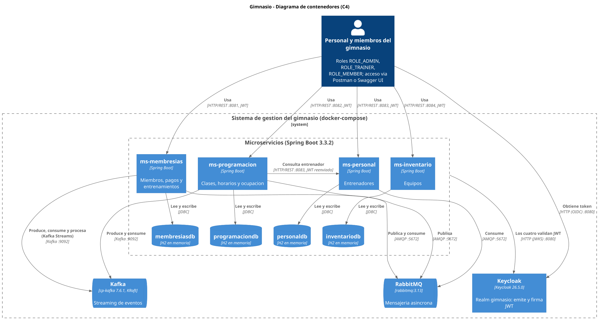

# Sistema de Gestión de un Gimnasio — de monolito a microservicios

Proyecto de la asignatura en dos talleres:

1. **Taller 1 — DDD:** transformar un monolito Spring Boot de gestión de gimnasio en una arquitectura de microservicios. Enunciado en [`docs/taller-1/Statement.pdf`](docs/taller-1/Statement.pdf), presentación en [`docs/taller-1/DDD-Monolito-a-Microservicios-Gimnasio.pptx`](docs/taller-1/DDD-Monolito-a-Microservicios-Gimnasio.pptx).
2. **Taller 2 — Seguridad, APIs RESTful y comunicación asíncrona:** Keycloak + JWT, Swagger/OpenAPI, RabbitMQ y Kafka sobre los mismos microservicios. Informe técnico y guion de presentación en [`docs/taller-2/INFORME.md`](docs/taller-2/INFORME.md).

## Contenido del repo

| Carpeta | Qué es |
|---|---|
| [`monilito-gimnasio/`](monilito-gimnasio) | El monolito original, punto de partida del taller |
| [`docs/taller-1/`](docs/taller-1) | Taller 1: análisis DDD ([`ddd-microservicios.md`](docs/taller-1/ddd-microservicios.md)), enunciado y presentación |
| [`docs/taller-2/`](docs/taller-2) | Taller 2: [`INFORME.md`](docs/taller-2/INFORME.md) (informe y guion), [`SWAGGER.md`](docs/taller-2/SWAGGER.md) (evidencias de la API), [`diagramas/`](docs/taller-2/diagramas) (PlantUML + PNG) y [`videos/`](docs/taller-2/videos) (demos en ejecución) |
| [`ms-membresias/`](ms-membresias) | Microservicio — contexto **Membresías** |
| [`ms-programacion/`](ms-programacion) | Microservicio — contexto **Programación** |
| [`ms-personal/`](ms-personal) | Microservicio — contexto **Personal** |
| [`ms-inventario/`](ms-inventario) | Microservicio — contexto **Inventario** |
| [`docker-compose.yml`](docker-compose.yml) | Levanta los 4 microservicios + Keycloak, RabbitMQ, Kafka y Kafka UI con un solo comando |
| [`keycloak/full-export/`](keycloak/full-export) | Configuración de Keycloak exportada (realm `gimnasio`, clientes, roles, usuarios de prueba) |
| [`postman/`](postman) | Colección de Postman con pruebas de seguridad, RabbitMQ, Kafka y de los endpoints de cada microservicio |

## Arquitectura

Cuatro microservicios independientes, uno por contexto acotado, cada uno con su propia base de datos (H2 en memoria). El único cruce entre servicios es **Programación → Personal**: al programar una clase se valida el `entrenadorId` contra `ms-personal` vía REST (reenviando el JWT del usuario). La comunicación asíncrona usa RabbitMQ (notificaciones, publish/subscribe y DLQ) y Kafka (streaming en tiempo real y Kafka Streams). Todos los endpoints están protegidos con JWT emitido por Keycloak y autorización basada en roles (`ROLE_ADMIN`, `ROLE_TRAINER`, `ROLE_MEMBER`).

| Microservicio | Puerto | Entidad | Endpoints | Roles permitidos |
|---|---|---|---|---|
| `ms-membresias` | `8081` | Miembro | `POST /api/miembros` | `ROLE_ADMIN` |
| | | | `GET /api/miembros` | `ROLE_ADMIN`, `ROLE_TRAINER` |
| | | | `POST /api/miembros/{id}/pagos`, `POST /api/miembros/{id}/entrenamientos` | `ROLE_ADMIN`, `ROLE_MEMBER` |
| `ms-programacion` | `8082` | Clase | `POST /api/clases`, `PATCH /api/clases/{id}/horario`, `POST /api/clases/{id}/ocupacion` | `ROLE_ADMIN`, `ROLE_TRAINER` |
| | | | `GET /api/clases`, `GET /api/clases/{id}/entrenador` | `ROLE_ADMIN`, `ROLE_TRAINER`, `ROLE_MEMBER` |
| | | | `POST /api/admin/kafka/ocupacion-clases/reiniciar`, `GET /api/admin/kafka/ocupacion-clases/estado` | `ROLE_ADMIN` |
| `ms-personal` | `8083` | Entrenador | `POST /api/entrenadores` | `ROLE_ADMIN` |
| | | | `GET /api/entrenadores`, `GET /api/entrenadores/{id}` | `ROLE_ADMIN`, `ROLE_TRAINER`, `ROLE_MEMBER` |
| `ms-inventario` | `8084` | Equipo | `POST /api/equipos` | `ROLE_ADMIN` |
| | | | `GET /api/equipos` | `ROLE_ADMIN`, `ROLE_TRAINER`, `ROLE_MEMBER` |

Diagrama de arquitectura (vista C4 de contenedores):



Más diagramas en [`docs/taller-2/diagramas/`](docs/taller-2/diagramas): secuencia de seguridad JWT, secuencias y topologías de RabbitMQ y Kafka. El diagrama de componentes del taller 1 está en [`docs/taller-1/ddd-microservicios.md`](docs/taller-1/ddd-microservicios.md#diagrama-de-componentes).

## Stack

Java 17 · Spring Boot 3.3.2 · Spring Data JPA · H2 (en memoria) · Spring Security (OAuth2 Resource Server / JWT) · Keycloak · springdoc-openapi (Swagger UI) · Spring AMQP + RabbitMQ · Spring Kafka + Kafka Streams · Maven (con wrapper `./mvnw`) · Spring `RestClient` para la comunicación entre servicios · Docker Compose.

## Seguridad: Keycloak + JWT

Cada microservicio valida los tokens JWT emitidos por un realm `gimnasio` en Keycloak (un cliente confidencial por microservicio) y autoriza cada endpoint según el rol del usuario (ver tabla de arriba). La configuración vive en:

- `src/main/java/co/analisys/<contexto>/config/SecurityConfig.java` — Spring Security como resource server JWT (Swagger UI queda público, todo lo demás requiere token).
- `src/main/java/co/analisys/<contexto>/config/KeycloakRealmRoleConverter.java` — mapea `realm_access.roles` del token a roles de Spring.
- [`keycloak/full-export/`](keycloak/full-export) — export real de Keycloak (`kc.sh export`, con los secrets reales de cada cliente y los usuarios de prueba con sus credenciales), usado por `docker-compose.yml` para reconstruir el realm cada vez que el contenedor arranca. No hay base de datos persistente: cualquier cambio manual en la consola de administración se pierde al recrear el contenedor — el realm siempre se reconstruye desde este archivo.

### Usuarios de prueba

| Usuario | Contraseña | Rol |
|---|---|---|
| `admin1` | `Admin@2024` | `ROLE_ADMIN` |
| `trainer1` | `Trainer@2024` | `ROLE_TRAINER` |
| `member1` | `Member@2024` | `ROLE_MEMBER` |

Consola de administración de Keycloak: `http://localhost:8080` — `admin` / `admin_password`.

### Obtener un token y llamar un endpoint protegido

```bash
TOKEN=$(curl -s 'http://localhost:8080/realms/gimnasio/protocol/openid-connect/token' \
  --data-urlencode 'grant_type=password' \
  --data-urlencode 'client_id=personal-service' \
  --data-urlencode 'client_secret=<ver client_secret en keycloak/full-export/gimnasio-realm.json>' \
  --data-urlencode 'username=trainer1' \
  --data-urlencode 'password=Trainer@2024' \
  | python3 -c "import json,sys; print(json.load(sys.stdin)['access_token'])")

curl -H "Authorization: Bearer $TOKEN" http://localhost:8083/api/entrenadores
```

Casos verificados: sin header `Authorization` → `401`; token inválido/expirado → `401`; rol sin permiso para el endpoint → `403`; rol correcto → `200`.

La colección de Postman obtiene los tokens de `admin1`, `trainer1` y `member1` en su carpeta `0. Auth` y los usa en el resto de requests.

## Mensajería asíncrona: RabbitMQ

Tres flujos de mensajería sobre RabbitMQ (topología en [`docs/taller-2/diagramas/05-rabbitmq-topologia.png`](docs/taller-2/diagramas/05-rabbitmq-topologia.png), secuencia en [`03-rabbitmq-secuencia.png`](docs/taller-2/diagramas/03-rabbitmq-secuencia.png)):

| Flujo | Productor → Consumidor | Exchange / cola |
|---|---|---|
| Notificación de inscripción | `ms-membresias` → `ms-membresias` | `membresias.exchange` → `notificacion.inscripcion.queue` |
| Pub/sub cambio de horario | `ms-programacion` → `ms-personal` | `programacion.exchange` → `horario.clase.queue` |
| DLQ de pagos fallidos | `ms-membresias` → `ms-membresias` | `pagos.exchange` → `pagos.procesar.queue` (dead-letters a `pagos.dlx` → `pagos.dlq` si el monto es inválido) |

`docker compose up` levanta también el contenedor `rabbitmq` (imagen `rabbitmq:3.13-management`). Consola de gestión: `http://localhost:15672` — `guest` / `guest`. Desde ahí se puede inspeccionar cada cola (mensajes pendientes, tasa de entrega) mientras se prueban los endpoints que publican eventos: `POST /api/miembros`, `PATCH /api/clases/{id}/horario`, `POST /api/miembros/{id}/pagos`.

## Streaming de eventos: Kafka

Dos flujos de streaming sobre Kafka (topología en [`docs/taller-2/diagramas/06-kafka-topologia.png`](docs/taller-2/diagramas/06-kafka-topologia.png), secuencia en [`04-kafka-secuencia.png`](docs/taller-2/diagramas/04-kafka-secuencia.png)):

| Flujo | Productor → Consumidor | Topic |
|---|---|---|
| Ocupación de clases en tiempo real | `ms-programacion` → `ms-programacion` | `ocupacion-clases` |
| Análisis de datos de entrenamiento (Kafka Streams, ventana de 5 min) | `ms-membresias` → `ms-membresias` (vía `datos-entrenamiento` → topología de agregación → `entrenamiento-resumen`) | `datos-entrenamiento`, `entrenamiento-resumen` |

`docker compose up` levanta también los contenedores `kafka` (imagen `confluentinc/cp-kafka`, modo KRaft sin Zookeeper) y `kafka-ui` (consola web). Consola: `http://localhost:8090` — cluster `local`, sin autenticación. Desde ahí se puede inspeccionar cada topic (particiones, mensajes, offset commiteado por cada consumer group) mientras se prueban los endpoints que publican eventos: `POST /api/clases/{id}/ocupacion`, `POST /api/miembros/{id}/entrenamientos`. El endpoint `POST /api/admin/kafka/ocupacion-clases/reiniciar` (solo `ROLE_ADMIN`) demuestra el mecanismo de recuperación ante fallos: aprovecha la retención de 7 días del topic `ocupacion-clases` para reprocesar el historial completo desde el offset 0. Además, al reiniciar un consumidor, cada partición retoma desde su último offset commiteado (commit manual tras procesar cada mensaje).

## Documentación de la API (Swagger/OpenAPI)

Cada microservicio expone su documentación sin necesidad de token en `http://localhost:<puerto>/swagger-ui/index.html` (JSON crudo en `/v3/api-docs`). Capturas y tabla de endpoints por servicio en [`docs/taller-2/SWAGGER.md`](docs/taller-2/SWAGGER.md).

## Cómo correrlo

### Opción 1: Docker Compose (recomendada)

Construye y levanta los 4 microservicios junto con Keycloak, RabbitMQ, Kafka y Kafka UI con un solo comando:

```bash
docker compose up --build
```

`ms-programacion` espera automáticamente a que `ms-personal` esté saludable antes de arrancar (`depends_on` + healthcheck), porque valida `entrenadorId` contra ese contexto por REST. Dentro de la red de Docker se resuelven por el nombre del servicio (`http://ms-personal:8083`), no por `localhost`.

Para detener todo:

```bash
docker compose down
```

### Opción 2: Maven, cada microservicio por separado

Cada microservicio es un proyecto Maven independiente y arranca solo (cada uno trae su propio `DataLoader` con datos de ejemplo). Para que la validación REST de `ms-programacion` funcione, levanta primero `ms-personal`:

```bash
# terminal 1
cd ms-personal && ./mvnw spring-boot:run

# terminal 2
cd ms-programacion && ./mvnw spring-boot:run

# terminal 3 y 4 (sin dependencias)
cd ms-membresias && ./mvnw spring-boot:run
cd ms-inventario && ./mvnw spring-boot:run
```

En Windows usa `mvnw.cmd` en lugar de `./mvnw`. Keycloak, RabbitMQ y Kafka siguen necesitando correr en Docker (`docker compose up -d keycloak rabbitmq kafka kafka-ui`); si los microservicios corren fuera de Docker, cambia `spring.security.oauth2.resourceserver.jwt.jwk-set-uri` en cada `application.properties` de `keycloak:8080` a `localhost:8080`. `spring.rabbitmq.host` no necesita ese mismo cambio: ya está configurado en `localhost` por defecto en cada `application.properties`, y solo se sobreescribe a `rabbitmq` vía variable de entorno cuando corre dentro de Docker Compose (Opción 1). `spring.kafka.bootstrap-servers` tampoco lo necesita: ya apunta a `localhost:9092` por defecto (el listener `PLAINTEXT_HOST` del broker), y solo se sobreescribe a `kafka:9092` dentro de Docker Compose.

### Probar los endpoints

Con los 4 microservicios, Keycloak, RabbitMQ y Kafka arriba (por cualquiera de las dos opciones), primero obtén un token (ver sección de Seguridad) y luego:

```bash
curl -H "Authorization: Bearer $TOKEN" http://localhost:8082/api/clases/1/entrenador
```

O importa [`postman/Gimnasio-Microservicios.postman_collection.json`](postman/Gimnasio-Microservicios.postman_collection.json) en Postman — trae una carpeta por microservicio con casos válidos y casos que verifican las invariantes de dominio (email inválido/duplicado, capacidad y cantidad negativas, especialidad fuera de catálogo, etc.), más `1. Seguridad (JWT)` (casos 401/403), `2. RabbitMQ` (dispara cada flujo de mensajería y verifica contra la Management API de RabbitMQ que el mensaje pasó por la cola esperada, incluyendo el camino que cae a la DLQ de pagos) y `3. Kafka` (dispara el reporte de ocupacion y el registro de entrenamientos, verifica contra la REST API de Kafka UI que cada consumer group avanzo su offset, y ejercita el endpoint de recuperacion que reinicia el consumo desde offset 0). También se puede correr desde la terminal con [newman](https://github.com/postmanlabs/newman):

```bash
newman run postman/Gimnasio-Microservicios.postman_collection.json
```

No hace falta `--delay-request` ni ningún otro delay global: cada chequeo que depende de un efecto asíncrono (offset commiteado en Kafka, `message_stats` de una cola en RabbitMQ) sondea con reintentos hasta ver el valor esperado o agotar un timeout generoso, en vez de asumir que una espera fija ya fue suficiente. Esto reemplazó un diseño anterior basado en un delay fijo antes de cada request, que era inherentemente frágil: tanto el offset de Kafka como `message_stats` de RabbitMQ los actualiza un agregador de estadísticas en un intervalo periódico (Kafka: hasta el `pollTimeout` del consumidor; RabbitMQ: ~5s por defecto), así que ninguna espera fija corta es fiable — y una lo bastante larga para el peor caso ralentiza toda la colección.

## Videos de demostración

Grabaciones del sistema en ejecución en [`docs/taller-2/videos/`](docs/taller-2/videos):

| Video | Qué muestra |
|---|---|
| [`01-seguridad.mp4`](docs/taller-2/videos/01-seguridad.mp4) | Respuestas 401 / 403 / 200 según el token y el rol, y reenvío del JWT entre servicios |
| [`02-rabbitmq-flujos.mp4`](docs/taller-2/videos/02-rabbitmq-flujos.mp4) | Notificación de inscripción y publish/subscribe de cambio de horario |
| [`03-rabbitmq-dlq.mp4`](docs/taller-2/videos/03-rabbitmq-dlq.mp4) | Pago válido procesado y pago inválido enviado a `pagos.dlq` |
| [`04-kafka-ocupacion.mp4`](docs/taller-2/videos/04-kafka-ocupacion.mp4) | Evento de ocupación consumido en tiempo real; offset y lag en Kafka UI |
| [`05-kafka-streams.mp4`](docs/taller-2/videos/05-kafka-streams.mp4) | Agregación de entrenamientos con Kafka Streams en `entrenamiento-resumen` |
| [`06-kafka-recuperacion.mp4`](docs/taller-2/videos/06-kafka-recuperacion.mp4) | Reinicio desde el último offset commiteado y reproceso desde offset 0 |
