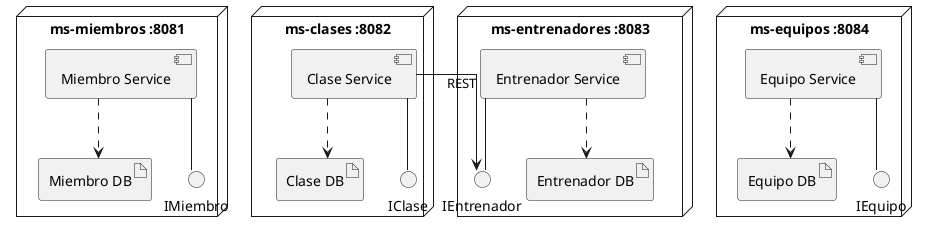

# Diseño DDD: de monolito a microservicios

Análisis aplicado al monolito en [`monilito-gimnasio/`](../monilito-gimnasio) siguiendo los pasos pedidos en [`Statement.pdf`](Statement.pdf).

## 1. Analizar el dominio

El monolito expone un único servicio (`GimnasioService`) y controlador (`GimnasioController`) que mezclan cuatro subdominios independientes, cada uno con su propio ciclo de vida y motivo de cambio:

| Subdominio | Entidad JPA | Atributos | Relaciones |
|---|---|---|---|
| Miembros | `Miembro` | `id, nombre, email, fechaInscripcion` | Ninguna |
| Clases | `Clase` | `id, nombre, horario, capacidadMaxima` | `@ManyToOne Entrenador` |
| Entrenadores | `Entrenador` | `id, nombre, especialidad` | Ninguna |
| Equipos | `Equipo` | `id, nombre, descripcion, cantidad` | Ninguna |

Observaciones clave:
- **Miembros**, **Entrenadores** y **Equipos** son subdominios autocontenidos: no tienen relaciones JPA hacia otras entidades.
- **Clases** es el único subdominio acoplado (`Clase.entrenador` vía `@ManyToOne`), lo que hoy obliga a compartir base de datos con Entrenadores.
- No existe relación `Miembro`↔`Clase` (sin inscripciones/reservas) ni `Clase`↔`Equipo` en el modelo actual — cada bounded context puede evolucionar sin arrastrar a los demás.

## 2. Definir los contextos acotados (Bounded Contexts)

Se identifican 4 contextos, alineados 1:1 con los componentes ya declarados en el enunciado:

1. **Gestión de Miembros** — alta y consulta de socios del gimnasio.
2. **Gestión de Clases** — programación de clases y su horario/capacidad.
3. **Gestión de Entrenadores** — alta y consulta del personal que dicta clases.
4. **Gestión de Equipos** — inventario de equipamiento del gimnasio.

El único cruce de contexto es **Clases → Entrenadores** (una clase la dicta un entrenador). Para que cada contexto tenga su propia base de datos (*database-per-service*), esa relación deja de ser un `@ManyToOne` JPA y pasa a ser una referencia por id (`entrenadorId`) resuelta vía llamada REST al servicio de Entrenadores cuando se necesite el detalle.

## 3. Definir entidades, agregados y servicios

Cada contexto se modela como un agregado con una única raíz (no hay sub-entidades internas en el monolito actual, así que raíz de agregado = entidad):

| Contexto | Raíz de agregado | Invariantes / responsabilidad del servicio |
|---|---|---|
| Miembros | `Miembro` | Unicidad de email, fecha de inscripción por defecto = hoy |
| Clases | `Clase` | `capacidadMaxima > 0`; `entrenadorId` debe existir (validado contra el contexto Entrenadores) |
| Entrenadores | `Entrenador` | Datos de contacto/especialidad del entrenador |
| Equipos | `Equipo` | `cantidad >= 0` (control de inventario) |

Cada agregado conserva su propio repositorio (`*Repository`) y servicio de aplicación (`*Service`), tal como ya están separados en el monolito — el trabajo de refactor es principalmente de **empaquetado** (moverlos a proyectos independientes) más el cambio de la relación `Clase.entrenador` a `entrenadorId`.

## 4. Identificar microservicios (máximo 4)

Se proponen exactamente 4 microservicios, uno por contexto acotado:

| Microservicio | Puerto sugerido | Entidad | Endpoints (equivalentes a `GimnasioController`) |
|---|---|---|---|
| `ms-miembros` | 8081 | Miembro | `POST/GET /api/miembros` |
| `ms-clases` | 8082 | Clase | `POST/GET /api/clases` |
| `ms-entrenadores` | 8083 | Entrenador | `POST/GET /api/entrenadores` |
| `ms-equipos` | 8084 | Equipo | `POST/GET /api/equipos` |

`ms-clases` es el único con una dependencia saliente: al crear/consultar una clase, llama por REST a `ms-entrenadores` (`GET /api/entrenadores/{id}`) para validar/enriquecer el `entrenadorId`.

## Diagrama de componentes

