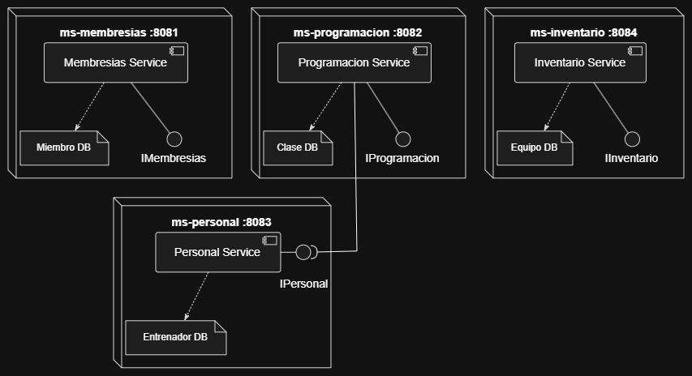

# Diseño DDD: de monolito a microservicios

Análisis aplicado al monolito en [`monilito-gimnasio/`](../monilito-gimnasio) siguiendo los pasos pedidos en [`Statement.pdf`](Statement.pdf).

## 1. Analizar el dominio

El monolito expone un único servicio (`GimnasioService`) y controlador (`GimnasioController`) que mezclan cuatro subdominios independientes, cada uno con su propio ciclo de vida y motivo de cambio:

| Subdominio | Entidad JPA | Atributos | Relaciones |
|---|---|---|---|
| Miembros | `Miembro` | `id, nombre, email, fechaInscripcion` | Ninguna |
| Clases | `Clase` | `id, nombre, horario, capacidadMaxima` | `@ManyToOne Entrenador` |
| Entrenadores | `Entrenador` | `id, nombre, especialidad` | Ninguna |
| Equipos | `Equipo` | `id, nombre, descripcion, cantidad` | Ninguna |

Observaciones clave:
- **Miembros**, **Entrenadores** y **Equipos** son subdominios autocontenidos: no tienen relaciones JPA hacia otras entidades.
- **Clases** es el único subdominio acoplado (`Clase.entrenador` vía `@ManyToOne`), lo que hoy obliga a compartir base de datos con Entrenadores.
- No existe relación `Miembro`↔`Clase` (sin inscripciones/reservas) ni `Clase`↔`Equipo` en el modelo actual — cada bounded context puede evolucionar sin arrastrar a los demás.

## 2. Definir los contextos acotados (Bounded Contexts)

Se identifican 4 contextos. Se nombran por la **capacidad de negocio** que cubren (ubiquitous language del contexto), no por el nombre crudo de la entidad JPA que hoy los respalda — así el nombre del contexto no queda atado al modelo de datos actual y puede seguir teniendo sentido aunque el contexto crezca con más entidades/reglas en el futuro:

| Contexto (capacidad de negocio) | Responsabilidad | Entidad JPA que lo respalda hoy |
|---|---|---|
| **Membresías** | Alta y consulta de socios del gimnasio | `Miembro` |
| **Programación** | Programación de clases, horario y capacidad | `Clase` |
| **Personal** | Alta y consulta del personal que dicta clases | `Entrenador` |
| **Inventario** | Gestión del equipamiento del gimnasio | `Equipo` |

El único cruce de contexto es **Programación → Personal** (una clase la dicta un entrenador). Para que cada contexto tenga su propia base de datos (*database-per-service*), esa relación deja de ser un `@ManyToOne` JPA y pasa a ser una referencia por id (`entrenadorId`) resuelta vía llamada REST al contexto de Personal cuando se necesite el detalle.

## 3. Definir entidades, agregados y servicios

Cada contexto se modela como un agregado con una única raíz (no hay sub-entidades internas en el monolito actual, así que raíz de agregado = entidad):

| Contexto | Raíz de agregado | Invariantes / responsabilidad del servicio |
|---|---|---|
| Membresías | `Miembro` | Unicidad de email, fecha de inscripción por defecto = hoy |
| Programación | `Clase` | `capacidadMaxima > 0`; `entrenadorId` debe existir (validado contra el contexto Personal) |
| Personal | `Entrenador` | Datos de contacto/especialidad del entrenador |
| Inventario | `Equipo` | `cantidad >= 0` (control de inventario) |

Cada agregado conserva su propio repositorio (`*Repository`) y servicio de aplicación (`*Service`), tal como ya están separados en el monolito — el trabajo de refactor es principalmente de **empaquetado** (moverlos a proyectos independientes) más el cambio de la relación `Clase.entrenador` a `entrenadorId`.

## 4. Identificar microservicios (máximo 4)

Se proponen 4 microservicios, uno por contexto acotado, nombrados por la capacidad de negocio (no por la entidad):

| Microservicio | Contexto | Puerto sugerido | Entidad principal | Endpoints (equivalentes a `GimnasioController`) |
|---|---|---|---|---|
| `ms-membresias` | Membresías | 8081 | Miembro | `POST/GET /api/miembros` |
| `ms-programacion` | Programación | 8082 | Clase | `POST/GET /api/clases` |
| `ms-personal` | Personal | 8083 | Entrenador | `POST/GET /api/entrenadores` |
| `ms-inventario` | Inventario | 8084 | Equipo | `POST/GET /api/equipos` |

`ms-programacion` es el único con una dependencia saliente: al crear/consultar una clase, llama por REST a `ms-personal` (`GET /api/entrenadores/{id}`) para validar/enriquecer el `entrenadorId`.

> **Mapeo 1:1 entidad↔microservicio.** Hoy cada contexto termina respaldado por exactamente una entidad porque el monolito es muy simple (4 entidades, casi sin invariantes compartidos entre ellas). Eso es una coincidencia del dominio actual, no una regla de DDD: un bounded context puede agrupar varios agregados que cambian juntos. Se evaluó fusionar **Programación** y **Personal** en un solo contexto (ya que `Clase` depende de `Entrenador`), pero se decidió mantenerlos separados en 4 microservicios independientes, precisamente para que la comunicación REST entre `ms-programacion` y `ms-personal` sea parte visible de la arquitectura (entregable opcional del taller).

## Diagrama de componentes

