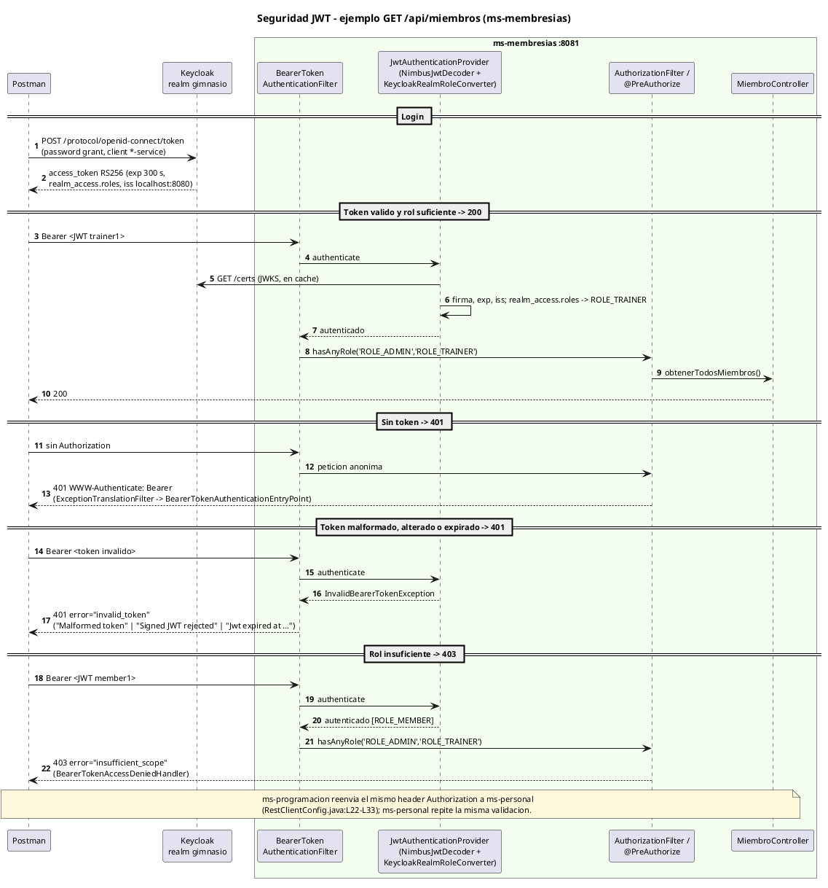
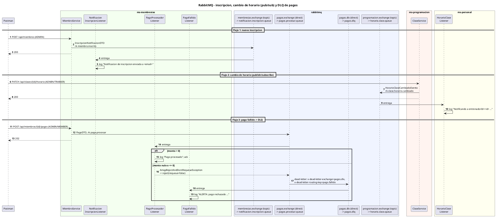
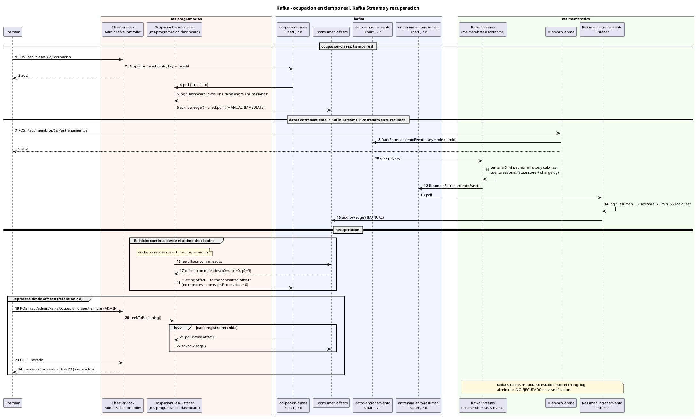
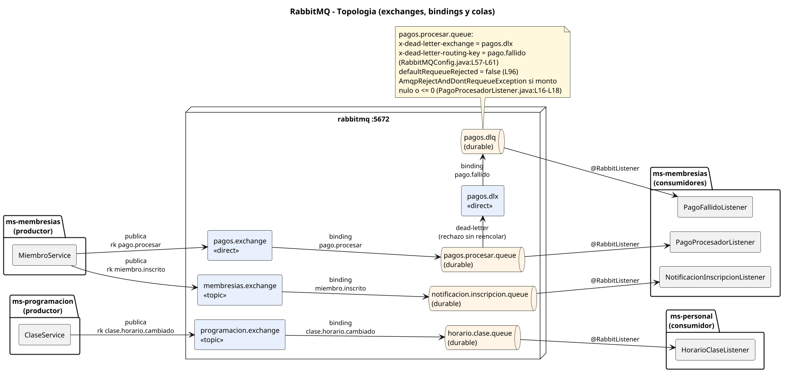
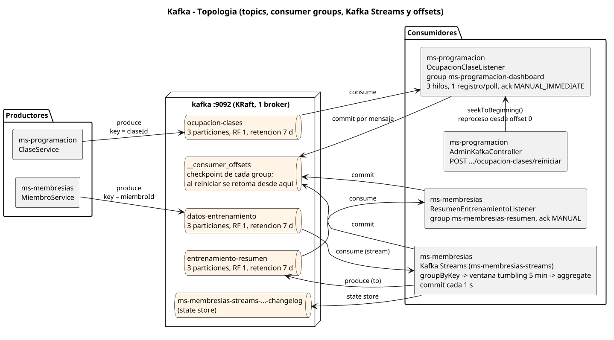

# Informe técnico — Seguridad, APIs RESTful y comunicación asíncrona en los microservicios del gimnasio

> Documento autocontenido: sirve como informe de lo realizado y como guion base de la presentación. Cada afirmación técnica cita el archivo y la línea donde está implementada. Lo que no se pudo comprobar en ejecución se marca **NO VERIFICADO** o **NO EJECUTADO**.
>
> Verificación en ejecución: 2026-09-26, sistema levantado con `docker compose up --build` a partir del commit `7e7b2b4` (imágenes construidas después de ese commit, sin cambios pendientes en `ms-*`).

---

## 1. Datos generales

| Campo | Valor |
|---|---|
| Proyecto | Sistema de Gestión de un Gimnasio — arquitectura de microservicios (repositorio `Microservicios-Gym`) |
| Taller | Implementación de Seguridad, APIs RESTful y Comunicación Asincrónica en Microservicios del Gimnasio |
| Curso | `[COMPLETAR]` |
| Integrantes | `[COMPLETAR]` |
| Duración máxima de la presentación | 30 minutos |
| Stack | Java 17, Spring Boot 3.3.2, Spring Security (OAuth2 Resource Server), Keycloak 26.5.0, springdoc-openapi 2.5.0, Spring AMQP + RabbitMQ 3.13, Spring Kafka + Kafka Streams sobre Confluent Kafka 7.6.1 (KRaft), H2 en memoria, Docker Compose |

## 2. Resumen ejecutivo

- **Seguridad (20 %).** Realm `gimnasio` con un cliente confidencial por microservicio, roles `ROLE_ADMIN`/`ROLE_TRAINER`/`ROLE_MEMBER` y tres usuarios de prueba; los 4 servicios validan JWT y autorizan con `@PreAuthorize`. Verificados en ejecución: 200, 401 (sin token, malformado, firma alterada, expirado) y 403. Swagger UI público en los 4 servicios con descripción y parámetros de cada operación.
- **RabbitMQ (25 %).** Los tres flujos funcionan en ejecución: notificación de inscripción, publish/subscribe de cambios de horario y pago fallido enviado a la DLQ (`pagos.procesar.queue` → `pagos.dlx` → `pagos.dlq`).
- **Kafka (25 %).** `ocupacion-clases` con productor y consumidor en tiempo real; Kafka Streams agrega `datos-entrenamiento` en ventanas de 5 minutos y publica en `entrenamiento-resumen`; retención de 7 días, checkpoint por commit manual de offsets, reinicio desde el último checkpoint y reproceso desde offset 0 (ambos verificados).

## 3. Arquitectura general

Diagrama: [`diagramas/01-arquitectura-c4.puml`](diagramas/01-arquitectura-c4.puml) (render: `diagramas/01-arquitectura-c4.png`): vista C4 de contenedores con las personas que usan el sistema, los microservicios y sus bases de datos, Keycloak, RabbitMQ y Kafka, con tecnología y protocolo en cada relación.

Los nodos de la arquitectura son servicios de `docker-compose.yml` (`kafka-ui` también está definido, `docker-compose.yml:L156-L166`, pero es una consola de apoyo y no forma parte de la arquitectura):

| Nodo | Imagen / puerto | Rol | Referencia |
|---|---|---|---|
| `ms-membresias` | build local, `8081` | Miembros; productor/consumidor RabbitMQ (inscripción, pagos, DLQ); productor Kafka `datos-entrenamiento`; Kafka Streams; consumidor `entrenamiento-resumen` | `docker-compose.yml:L20-L37` |
| `ms-programacion` | build local, `8082` | Clases; productor RabbitMQ (cambio de horario); productor y consumidor Kafka `ocupacion-clases`; endpoint de recuperación | `docker-compose.yml:L50-L72` |
| `ms-personal` | build local, `8083` | Entrenadores; consumidor RabbitMQ del cambio de horario | `docker-compose.yml:L2-L18` |
| `ms-inventario` | build local, `8084` | Equipos; solo seguridad (sin mensajería) | `docker-compose.yml:L39-L48` |
| `keycloak` | `quay.io/keycloak/keycloak:26.5.0`, `8080` | Emisión de JWT; importa el realm desde `keycloak/full-export/` al arrancar (`start-dev --import-realm`) | `docker-compose.yml:L85-L99` |
| `rabbitmq` | `rabbitmq:3.13-management`, `5672` / `15672` | Broker AMQP + consola de gestión | `docker-compose.yml:L108-L119` |
| `kafka` | `confluentinc/cp-kafka:7.6.1`, `9092` | Broker único en modo KRaft (sin Zookeeper); listener interno `kafka:9092` y externo `localhost:9092` | `docker-compose.yml:L129-L150` |
| `kafka-ui` | `provectuslabs/kafka-ui:v0.7.2`, `8090` | Consola web de topics, mensajes y offsets | `docker-compose.yml:L156-L166` |

Cada microservicio tiene su propia base H2 en memoria (por ejemplo `ms-membresias/src/main/resources/application.properties:L4`). La única llamada REST entre servicios es `ms-programacion → ms-personal`, que reenvía el header `Authorization` de la petición original (`ms-programacion/src/main/java/co/analisys/programacion/config/RestClientConfig.java:L22-L33`).

## 4. Seguridad: Keycloak + Spring Security + JWT

Diagrama: [`diagramas/02-seguridad-secuencia.puml`](diagramas/02-seguridad-secuencia.puml). Evidencias de la API: [`SWAGGER.md`](SWAGGER.md).

### 4.1 Configuración de Keycloak

Export ubicado en `keycloak/full-export/` y montado en el contenedor (`docker-compose.yml:L97-L99`). El realm se reconstruye desde estos archivos en cada recreación del contenedor (no hay volumen persistente).

| Elemento | Valor | Referencia |
|---|---|---|
| Realm | `gimnasio` | `keycloak/full-export/gimnasio-realm.json:L3` |
| Algoritmo de firma | `RS256` | `gimnasio-realm.json:L5` |
| Vida del access token | `300` s (5 min) | `gimnasio-realm.json:L8` |
| Roles de realm | `ROLE_ADMIN` ("Administrador del gimnasio"), `ROLE_TRAINER` ("Entrenador"), `ROLE_MEMBER` ("Miembro del gimnasio") | `gimnasio-realm.json:L51`, `L67`, `L89` |
| Clientes | `inventario-service`, `membresias-service`, `personal-service`, `programacion-service`: confidenciales (`publicClient=false`, autenticación `client-secret`), con *Direct Access Grants* y *Service Accounts* habilitados; `redirectUris` `http://localhost:808X/*` | `gimnasio-realm.json:L547`, `L577`, `L607`, `L637` |
| Usuarios de prueba | `admin1` → `ROLE_ADMIN`; `trainer1` → `ROLE_TRAINER`; `member1` → `ROLE_MEMBER` (credencial de tipo password) | `keycloak/full-export/gimnasio-users-0.json:L5/L21`, `L103/L119`, `L26/L42` |
| Cuentas de servicio | `service-account-*-service` (una por cliente), solo con `default-roles-gimnasio` | `gimnasio-users-0.json:L47-L98` |

Las contraseñas de los usuarios de prueba y los *client secrets* están en el export y en el `README.md` del repositorio; no se reproducen en este documento.

### 4.2 Validación del token en cada microservicio

Los cuatro servicios tienen la misma configuración:

- `spring.security.oauth2.resourceserver.jwt.issuer-uri=http://localhost:8080/realms/gimnasio` y `jwk-set-uri=http://keycloak:8080/realms/gimnasio/protocol/openid-connect/certs` (`ms-membresias/src/main/resources/application.properties:L11-L12`; iguales en los demás servicios). La firma se valida con las claves públicas del JWKS (resueltas por el nombre de red `keycloak`) y el claim `iss` debe coincidir con `http://localhost:8080/realms/gimnasio`; por eso el token debe pedirse a `localhost:8080`.
- `SecurityFilterChain` stateless, CSRF deshabilitado, Swagger público y todo lo demás autenticado; resource server JWT con un conversor propio (`ms-membresias/src/main/java/co/analisys/membresias/config/SecurityConfig.java:L21-L43`). `@EnableMethodSecurity` habilita `@PreAuthorize` (`SecurityConfig.java:L18`).
- `KeycloakRealmRoleConverter` toma `realm_access.roles` del JWT y crea una `SimpleGrantedAuthority` por rol, agregando el prefijo `ROLE_` solo si el rol no lo trae (`ms-membresias/src/main/java/co/analisys/membresias/config/KeycloakRealmRoleConverter.java:L14-L25`).
- No hay manejadores propios de 401/403: se usan los de Spring Security para resource servers (`BearerTokenAuthenticationEntryPoint`, `BearerTokenAccessDeniedHandler`), que agregan el header `WWW-Authenticate`.

### 4.3 Autorización por rol

| Servicio | Endpoint | Roles | Referencia |
|---|---|---|---|
| ms-membresias | `POST /api/miembros` | ADMIN | `MiembroController.java:L29` |
| | `GET /api/miembros` | ADMIN, TRAINER | `MiembroController.java:L38` |
| | `POST /api/miembros/{id}/pagos` | ADMIN, MEMBER | `MiembroController.java:L48` |
| | `POST /api/miembros/{id}/entrenamientos` | ADMIN, MEMBER | `MiembroController.java:L60` |
| ms-programacion | `POST /api/clases` | ADMIN, TRAINER | `ClaseController.java:L31` |
| | `GET /api/clases`, `GET /api/clases/{id}/entrenador` | ADMIN, TRAINER, MEMBER | `ClaseController.java:L40`, `L49` |
| | `PATCH /api/clases/{id}/horario` | ADMIN, TRAINER | `ClaseController.java:L59` |
| | `POST /api/clases/{id}/ocupacion` | ADMIN, TRAINER | `ClaseController.java:L71` |
| | `POST /api/admin/kafka/ocupacion-clases/reiniciar`, `GET .../estado` | ADMIN | `AdminKafkaController.java:L29`, `L38` |
| ms-personal | `POST /api/entrenadores` | ADMIN | `EntrenadorController.java:L26` |
| | `GET /api/entrenadores`, `GET /api/entrenadores/{id}` | ADMIN, TRAINER, MEMBER | `EntrenadorController.java:L35`, `L44` |
| ms-inventario | `POST /api/equipos` | ADMIN | `EquipoController.java:L25` |
| | `GET /api/equipos` | ADMIN, TRAINER, MEMBER | `EquipoController.java:L34` |

### 4.4 Pruebas de seguridad (ejecutadas el 2026-09-26)

| Caso | Petición | Resultado observado |
|---|---|---|
| Sin token | `GET :8081/api/miembros`, `GET :8083/api/entrenadores` | `401`, `WWW-Authenticate: Bearer` |
| Token malformado | `Authorization: Bearer abc.def.ghi` | `401`, `error="invalid_token"`, "Malformed token" |
| Firma alterada | último carácter del JWT cambiado | `401`, `error="invalid_token"`, "Signed JWT rejected" |
| Token expirado | token de `admin1` usado 375 s después de emitido | `401`, "Jwt expired at 2026-09-26T23:07:49Z" |
| Rol insuficiente | MEMBER en `GET :8081/api/miembros`, `POST :8082/api/clases`, `PATCH :8082/api/clases/1/horario`, `POST :8084/api/equipos`; TRAINER en `POST :8081/api/miembros`, `POST :8081/api/miembros/1/pagos`, `POST :8083/api/entrenadores`, `POST :8082/api/admin/kafka/.../reiniciar` | `403`, `error="insufficient_scope"` |
| Rol correcto | TRAINER y ADMIN en `GET :8081/api/miembros`; MEMBER en `GET :8082/api/clases`, `GET :8083/api/entrenadores`, `GET :8084/api/equipos` | `200` |
| Propagación del JWT | MEMBER en `GET :8082/api/clases/1/entrenador` (ms-programacion llama a ms-personal) | `200` |
| Swagger público | `GET :8084/v3/api-docs`, `GET :8084/swagger-ui/index.html` sin token | `200` |

La colección `postman/Gimnasio-Microservicios.postman_collection.json` automatiza los casos sin token, token inválido y rol insuficiente (carpeta `1. Seguridad (JWT)`). El caso de token **expirado** se verificó manualmente; no está en la colección.

## 5. RabbitMQ

Diagramas: [`diagramas/05-rabbitmq-topologia.puml`](diagramas/05-rabbitmq-topologia.puml) (topología estática: productor → exchange → binding → cola → consumidor, con la DLX/DLQ y sus argumentos reales) y [`diagramas/03-rabbitmq-secuencia.puml`](diagramas/03-rabbitmq-secuencia.puml) (secuencia de los tres flujos).

### 5.1 Configuración

- Conexión: `spring.rabbitmq.host=localhost`, `port=5672`, `guest/guest` (`ms-membresias/src/main/resources/application.properties:L14-L17`); en Docker se sobreescribe con `SPRING_RABBITMQ_HOST: rabbitmq` (`docker-compose.yml:L7`, `L25`, `L58`).
- Serialización JSON con `Jackson2JsonMessageConverter` en los tres servicios con mensajería (`ms-membresias/.../config/RabbitMQConfig.java:L79-L82`).
- Contenedor de listeners con `setDefaultRequeueRejected(false)`: un mensaje cuyo listener lanza excepción no se reencola (`ms-membresias/.../config/RabbitMQConfig.java:L91-L98`; `ms-personal/.../config/RabbitMQConfig.java:L44-L51`).
- Topología verificada en el broker (Management API):

| Exchange (tipo) | Routing key | Cola | Argumentos | Declarada en |
|---|---|---|---|---|
| `membresias.exchange` (topic) | `miembro.inscrito` | `notificacion.inscripcion.queue` (durable) | — | `ms-membresias/.../RabbitMQConfig.java:L31-L44` |
| `programacion.exchange` (topic) | `clase.horario.cambiado` | `horario.clase.queue` (durable) | — | `ms-personal/.../RabbitMQConfig.java:L24-L37` (exchange también en `ms-programacion/.../RabbitMQConfig.java:L19-L22`) |
| `pagos.exchange` (direct) | `pago.procesar` | `pagos.procesar.queue` (durable) | `x-dead-letter-exchange=pagos.dlx`, `x-dead-letter-routing-key=pago.fallido` | `ms-membresias/.../RabbitMQConfig.java:L46-L72` |
| `pagos.dlx` (direct) | `pago.fallido` | `pagos.dlq` (durable) | — | `ms-membresias/.../RabbitMQConfig.java:L51-L77` |

### 5.2 Flujos

1. **Notificación de nueva inscripción.** `MiembroService.registrarMiembro` guarda el miembro y publica `InscripcionNotificacionDTO{miembroId, nombre, email, fechaInscripcion}` en `membresias.exchange` con `miembro.inscrito` (`ms-membresias/.../service/MiembroService.java:L40-L42`). `NotificacionInscripcionListener` consume `notificacion.inscripcion.queue` y registra la notificación en consola (`messaging/NotificacionInscripcionListener.java:L11-L15`).
2. **Cambio de horario (publish/subscribe).** `ClaseService.cambiarHorario` reprograma la clase y publica `HorarioClaseCambiadoEvento{claseId, nombreClase, horarioAnterior, horarioNuevo, entrenadorId}` en `programacion.exchange` con `clase.horario.cambiado` (`ms-programacion/.../service/ClaseService.java:L61-L73`). ms-personal consume con `HorarioClaseListener` (`ms-personal/.../messaging/HorarioClaseListener.java:L11-L16`). El productor no conoce a los suscriptores; hoy existe un único suscriptor. El evento vive en el paquete `co.analisys.gimnasio.eventos` en ambos servicios para que el tipo se resuelva por el header `__TypeId__` (`ms-programacion/src/main/java/co/analisys/gimnasio/eventos/HorarioClaseCambiadoEvento.java:L5-L14`).
3. **Pago fallido → DLQ.** `MiembroService.registrarPago` publica `PagoDTO{miembroId, monto, concepto}` en `pagos.exchange` con `pago.procesar` (`MiembroService.java:L51-L57`). `PagoProcesadorListener` procesa el pago si `monto > 0`; si `monto` es nulo o `<= 0` lanza `AmqpRejectAndDontRequeueException` (`messaging/PagoProcesadorListener.java:L14-L22`). El broker envía el mensaje rechazado a `pagos.dlx` con la routing key `pago.fallido`, que lo enruta a `pagos.dlq`; `PagoFallidoListener` lo registra como alerta de seguimiento manual (`messaging/PagoFallidoListener.java:L11-L15`).

### 5.3 Evidencia de ejecución (2026-09-26 23:03 UTC)

```
POST /api/miembros (ADMIN)                -> 200
  Notificacion de inscripcion enviada a demo.1790463818@gym.com: bienvenido/a al gimnasio, Demo Inscripcion (miembroId=7)
PATCH /api/clases/1/horario (ADMIN)       -> 200
  [ms-personal] Notificando a entrenadorId=1: la clase 'Yoga Matutino' (id=1) cambio de horario de 2026-09-20T09:00 a 2026-12-01T18:30
POST /api/miembros/1/pagos monto=50000    -> 202
  Pago procesado para miembroId=1: 50000 (Mensualidad)
POST /api/miembros/1/pagos monto=-10      -> 202
  WARN ... ConditionalRejectingErrorHandler : Execution of Rabbit message listener failed.
  Caused by: org.springframework.amqp.AmqpRejectAndDontRequeueException: Monto de pago invalido para miembroId=1: -10
  ALERTA: pago rechazado para miembroId=1, monto=-10, concepto=Pago invalido demo -- requiere seguimiento manual
Estadisticas: pagos.procesar.queue deliver_get=6 ack=3 redeliver=0 | pagos.dlq deliver_get=3 ack=3
```

`redeliver=0`: el mensaje rechazado pasa directamente a la DLQ. Como `PagoFallidoListener` consume de inmediato, `pagos.dlq` queda vacía en reposo; la prueba de que el mensaje pasó por la DLQ es el contador `deliver_get` (así lo verifica también la colección de Postman).

## 6. Kafka

Diagramas: [`diagramas/06-kafka-topologia.puml`](diagramas/06-kafka-topologia.puml) (topología estática: productores → topics con particiones, key, retención y réplicas → consumer groups y Kafka Streams, más el checkpoint en `__consumer_offsets`) y [`diagramas/04-kafka-secuencia.puml`](diagramas/04-kafka-secuencia.puml) (secuencia de los flujos y de la recuperación).

### 6.1 Configuración

- Broker único en modo KRaft, listeners `PLAINTEXT://kafka:9092` (red Docker) y `PLAINTEXT_HOST://localhost:9092` (host) (`docker-compose.yml:L129-L150`). Los servicios usan `spring.kafka.bootstrap-servers=localhost:9092` y en Docker `SPRING_KAFKA_BOOTSTRAP_SERVERS: kafka:9092` (`ms-programacion/src/main/resources/application.properties:L22-L23`, `docker-compose.yml:L26`, `L59`).
- Productores: key `String`, valor JSON (`JsonSerializer`) (`ms-programacion/.../config/KafkaProducerConfig.java:L27-L34`; `ms-membresias/.../config/KafkaProducerConfig.java:L28-L35`).
- Consumidores: `enable.auto.commit=false`, `ErrorHandlingDeserializer` + `JsonDeserializer` con tipo por defecto (`ms-programacion/.../config/KafkaConsumerConfig.java:L25-L43`; `ms-membresias/.../config/KafkaConsumerConfig.java:L25-L36`).

| Topic | Particiones | RF | Retención | Key | Productor | Consumidor(es) | Declarado en |
|---|---|---|---|---|---|---|---|
| `ocupacion-clases` | 3 | 1 | `604800000` ms (7 d) | `claseId` | `ClaseService` | `OcupacionClaseListener`, group `ms-programacion-dashboard` | `ms-programacion/.../KafkaProducerConfig.java:L41-L47` |
| `datos-entrenamiento` | 3 | 1 | 7 d | `miembroId` | `MiembroService` | Kafka Streams `ms-membresias-streams` | `ms-membresias/.../KafkaProducerConfig.java:L42-L48` |
| `entrenamiento-resumen` | 3 | 1 | 7 d | `miembroId` | Kafka Streams | `ResumenEntrenamientoListener`, group `ms-membresias-resumen` | `ms-membresias/.../KafkaProducerConfig.java:L50-L56` |
| `ms-membresias-streams-KSTREAM-AGGREGATE-STATE-STORE-0000000001-changelog` | — | — | — | — | Kafka Streams (interno) | Kafka Streams (restauración) | Creado por Kafka Streams |

Particiones, RF y retención verificados con `kafka-topics --describe`.

### 6.2 `ocupacion-clases`: productor y consumidor en tiempo real

- `ClaseService.reportarOcupacion` valida la clase (404) y que la ocupación no sea negativa (400) y publica `OcupacionClaseEvento{claseId, ocupacionActual, timestamp}` con key `claseId` (`ms-programacion/.../service/ClaseService.java:L75-L88`). Al usar la clase como key, todos los eventos de una clase van a la misma partición y conservan el orden.
- `OcupacionClaseListener` (`@KafkaListener(id="ocupacion-clases-listener", groupId="ms-programacion-dashboard")`) imprime la ocupación, incrementa un contador y confirma el offset (`messaging/OcupacionClaseListener.java:L19-L25`). Concurrencia 3 (un hilo por partición), `max.poll.records=1`, `AckMode.MANUAL_IMMEDIATE`, `pollTimeout=1000` (`config/KafkaConsumerConfig.java:L39`, `L57`, `L63-L64`).

### 6.3 `datos-entrenamiento` → Kafka Streams → `entrenamiento-resumen`

- `MiembroService.registrarEntrenamiento` valida el miembro (404) y los valores (400) y publica `DatoEntrenamientoEvento{miembroId, duracionMinutos, calorias, timestamp}` con key `miembroId` (`ms-membresias/.../service/MiembroService.java:L59-L73`).
- Topología (`config/KafkaStreamsConfig.java:L59-L84`): `stream("datos-entrenamiento")` → `groupByKey()` → `windowedBy(TimeWindows.ofSizeWithNoGrace(Duration.ofMinutes(5)))` → `aggregate(ResumenAcumulador)` (suma minutos y calorías, cuenta sesiones) → `toStream().map(ResumenEntrenamientoEvento{..., ventanaInicio, ventanaFin})` → `to("entrenamiento-resumen")`.
- `application.id=ms-membresias-streams`, `commit.interval.ms=1000` (`KafkaStreamsConfig.java:L39`, `L47`); ante una excepción no capturada se reemplaza el hilo de Streams (`KafkaStreamsConfig.java:L51-L57`).
- `ResumenEntrenamientoListener` (group `ms-membresias-resumen`, `AckMode.MANUAL`) imprime cada resumen (`messaging/ResumenEntrenamientoListener.java:L11-L18`; `config/KafkaConsumerConfig.java:L43`).
- La ventana de 5 minutos se calcula con el timestamp del registro Kafka.

### 6.4 Recuperación ante fallos

| Mecanismo | Implementación | Estado |
|---|---|---|
| Retención de logs | `retention.ms=604800000` (7 días) en los tres topics (`ms-programacion/.../KafkaProducerConfig.java:L45`; `ms-membresias/.../KafkaProducerConfig.java:L46`, `L54`) | Verificado en el broker |
| Checkpoint de offsets | Auto-commit deshabilitado; `acknowledge()` tras procesar cada mensaje con `MANUAL_IMMEDIATE` guarda el offset en `__consumer_offsets` de inmediato (`OcupacionClaseListener.java:L24`; `KafkaConsumerConfig.java:L32`, `L57`) | Verificado |
| Reinicio desde el último checkpoint | Al reiniciar la instancia, el consumer group retoma desde el offset commiteado de cada partición | Verificado (ver 6.5) |
| Reproceso completo | `POST /api/admin/kafka/ocupacion-clases/reiniciar` → `OcupacionClaseListener.seekToBeginning()` (`AbstractConsumerSeekAware`); el seek se aplica en el siguiente `poll()` y se reprocesa todo lo retenido (`AdminKafkaController.java:L27-L32`) | Verificado |
| Restauración del estado de Kafka Streams | State store respaldado por el topic changelog | **NO EJECUTADO** (no se reinició ms-membresias) |

Sin offset commiteado previo, el consumidor usa `auto.offset.reset` por defecto de Kafka (`latest`), porque el proyecto no lo configura.

### 6.5 Evidencia de ejecución (2026-09-26 23:04–23:05 UTC)

```
POST /api/clases/1/ocupacion {ocupacionActual:14}      -> 202
  Dashboard: clase 1 tiene ahora 14 personas (timestamp=2026-09-26T23:04:15.915809880Z)
  ms-programacion-dashboard  ocupacion-clases p0 committed 3 -> 4 (lag 0)
POST /api/miembros/1/entrenamientos x2 (45 min/400 cal, 30 min/250 cal) -> 202, 202
  Resumen de entrenamiento miembroId=1: 2 sesiones, 75 min, 650 calorias (ventana 2026-09-26T23:00:00Z - 2026-09-26T23:05:00Z)

Reproceso desde offset 0:
  GET  .../estado      -> {"mensajesProcesados":16}
  POST .../reiniciar   -> 202
  GET  .../estado      -> {"mensajesProcesados":23}   (7 reprocesados = 4 + 3 + 0 retenidos en p0, p2, p1)

Reinicio de la instancia (docker compose restart ms-programacion):
  committed antes: p0=4, p1=0, p2=3
  Setting offset for partition ocupacion-clases-0 to the committed offset FetchPosition{offset=4, ...}
  Setting offset for partition ocupacion-clases-1 to the committed offset FetchPosition{offset=0, ...}
  Setting offset for partition ocupacion-clases-2 to the committed offset FetchPosition{offset=3, ...}
  GET .../estado -> {"mensajesProcesados":0}   (no reprocesa lo ya confirmado)
  nuevo evento   -> {"mensajesProcesados":1}, p0 committed=5
```

---

## 7. Guion de la presentación (16 diapositivas, 28 min + 2 min de margen)

Los recursos `diagramas/*.png` son los renders de los `.puml` homónimos de la misma carpeta. Secuencia: contexto y arquitectura → seguridad → demo de seguridad → RabbitMQ (diagrama + demo con DLQ) → Kafka (diagrama + demo + recuperación) → verificación automatizada → conclusiones. Las demos ocupan 13 de los 28 minutos.

| # | Título | Tiempo |
|---|---|---|
| 1 | Contexto: del monolito a 4 microservicios | 1:00 |
| 2 | Arquitectura: vista de contenedores | 2:00 |
| 3 | Keycloak: realm, clientes, roles y usuarios | 1:30 |
| 4 | Flujo JWT: autenticación y autorización | 2:00 |
| 5 | Código de seguridad | 1:30 |
| 6 | Documentación OpenAPI | 1:00 |
| 7 | DEMO: seguridad (200 / 401 / 403) | 3:00 |
| 8 | RabbitMQ: topología y flujos | 1:30 |
| 9 | DEMO: inscripción y pub/sub de horarios | 2:00 |
| 10 | DEMO: pago fallido → DLQ | 2:00 |
| 11 | Kafka: topics y flujos | 1:30 |
| 12 | DEMO: ocupación de clases en tiempo real | 2:00 |
| 13 | DEMO: Kafka Streams — resumen de entrenamiento | 1:30 |
| 14 | DEMO: recuperación (checkpoint y reproceso) | 2:30 |
| 15 | Verificación automatizada con Postman/newman | 1:30 |
| 16 | Conclusiones y preguntas | 1:30 |
| | **Total** | **28:00** |

### Diapositiva 1 — Contexto: del monolito a 4 microservicios (1:00)
- **Mensaje clave:** los 4 microservicios del taller anterior ahora son seguros y se comunican de forma asíncrona.
- **Viñetas:** 4 contextos: membresías, programación, personal, inventario · Seguridad: Keycloak + JWT · Mensajería: RabbitMQ · Streaming: Kafka · Todo con `docker compose up --build`
- **Recurso visual:** tabla de la sección 3.
- **Notas del orador:** presentar el alcance del taller y los tres ejes evaluados (20/25/25 %). Anunciar que todo lo que se muestra se ejecutó sobre el sistema real.

### Diapositiva 2 — Arquitectura: vista de contenedores (2:00)
- **Mensaje clave:** 4 microservicios con su propia base H2; todos validan JWT contra Keycloak y tres de ellos se comunican por RabbitMQ y Kafka.
- **Viñetas:** Keycloak emite y firma los JWT (RS256) · ms-programacion → ms-personal por REST reenviando el JWT · RabbitMQ: ms-membresias, ms-programacion, ms-personal · Kafka: ms-membresias, ms-programacion · ms-inventario solo usa seguridad
- **Recurso visual:** `diagramas/01-arquitectura-c4.png`.
- **Notas del orador:** recorrer de arriba hacia abajo: personas, microservicios con sus bases, infraestructura. Señalar que la validación de JWT es la misma para los cuatro servicios (una sola relación hacia Keycloak) y que la única llamada REST entre servicios es programación → personal.

### Diapositiva 3 — Keycloak: realm, clientes, roles y usuarios (1:30)
- **Mensaje clave:** el realm `gimnasio` está versionado en el repositorio y se importa en cada arranque.
- **Viñetas:** 4 clientes confidenciales `*-service` · Roles de realm `ROLE_ADMIN`, `ROLE_TRAINER`, `ROLE_MEMBER` · Usuarios `admin1`, `trainer1`, `member1` · Token de 5 minutos · Export en `keycloak/full-export/`
- **Recurso visual:** tabla 4.1; captura de la consola de Keycloak (pendiente, ver sección 10).
- **Notas del orador:** explicar que `--import-realm` reconstruye el realm desde el export, por lo que cualquier cambio manual en la consola se pierde al recrear el contenedor.

### Diapositiva 4 — Flujo JWT: autenticación y autorización (2:00)
- **Mensaje clave:** 401 cuando no se sabe quién es; 403 cuando se sabe pero no tiene permiso.
- **Viñetas:** Login con *password grant* → JWT · El servicio verifica firma (JWKS), expiración y emisor · `realm_access.roles` → autoridades de Spring · `@PreAuthorize` decide por rol
- **Recurso visual:** `diagramas/02-seguridad-secuencia.png`.
- **Notas del orador:** seguir los casos del diagrama. Destacar que el issuer debe ser `localhost:8080` aunque el JWKS se lea de `keycloak:8080`.

### Diapositiva 5 — Código de seguridad (1:30)
- **Mensaje clave:** tres piezas: filter chain, conversor de roles y `@PreAuthorize`.
- **Viñetas:** Stateless, sin CSRF · Swagger público · Conversor propio de roles de realm · Roles declarados en cada endpoint
- **Recurso visual:** fragmentos 9.1, 9.2 y 9.3.
- **Notas del orador:** mostrar que los cuatro servicios comparten la misma configuración; la diferencia está en los roles de cada endpoint.

### Diapositiva 6 — Documentación OpenAPI (1:00)
- **Mensaje clave:** cada servicio publica Swagger UI sin token, con descripciones y parámetros.
- **Viñetas:** `/swagger-ui/index.html` y `/v3/api-docs` por puerto · `@Tag`, `@Operation`, `@Parameter`
- **Recurso visual:** `swagger/img/ms-programacion.png`.
- **Notas del orador:** mostrar que Swagger UI y `/v3/api-docs` son públicos, y que cada operación muestra resumen, descripción, parámetros y esquemas de request/response.

### Diapositiva 7 — DEMO: seguridad (3:00)
- **Mensaje clave:** el mismo endpoint responde 401, 403 o 200 según el token.
- **Viñetas:** Sin token → 401 · Token alterado → 401 · MEMBER en `GET /api/miembros` → 403 · TRAINER → 200 · MEMBER consulta clase + entrenador → 200 (JWT propagado)
- **Recurso visual:** terminal o Postman (carpeta `1. Seguridad (JWT)`); pasos en 8.2.
- **Notas del orador:** mostrar el header `WWW-Authenticate` en cada error. Mencionar el token expirado con el mensaje real observado ("Jwt expired at ...").

### Diapositiva 8 — RabbitMQ: topología y flujos (1:30)
- **Mensaje clave:** tres patrones: notificación, publish/subscribe y dead letter.
- **Viñetas:** `membresias.exchange` → `notificacion.inscripcion.queue` · `programacion.exchange` → `horario.clase.queue` · `pagos.exchange` → `pagos.procesar.queue` · Rechazo → `pagos.dlx` → `pagos.dlq`
- **Recurso visual:** `diagramas/05-rabbitmq-topologia.png`; `diagramas/03-rabbitmq-secuencia.png` como apoyo para el orden de los mensajes.
- **Notas del orador:** recorrer la topología de izquierda a derecha: el productor solo conoce el exchange y la routing key; el broker enruta a la cola por el binding. Señalar la cadena `pagos.procesar.queue` → `pagos.dlx` → `pagos.dlq`.

### Diapositiva 9 — DEMO: inscripción y pub/sub de horarios (2:00)
- **Mensaje clave:** el endpoint responde de inmediato y el consumidor procesa en paralelo.
- **Viñetas:** `POST /api/miembros` → log de notificación · `PATCH /api/clases/1/horario` → log en ms-personal · Contadores en la consola de RabbitMQ
- **Recurso visual:** terminal con logs + `http://localhost:15672/#/queues`; pasos en 8.3.
- **Notas del orador:** remarcar que el mensaje del cambio de horario cruza de ms-programacion a ms-personal sin llamada REST.

### Diapositiva 10 — DEMO: pago fallido → DLQ (2:00)
- **Mensaje clave:** un pago inválido no se pierde: termina en la DLQ y genera una alerta.
- **Viñetas:** Monto válido → "Pago procesado" · Monto negativo → rechazo sin reencolar · Dead-letter a `pagos.dlq` · `deliver_get` de `pagos.dlq` sube en 1
- **Recurso visual:** logs de ms-membresias + cola `pagos.dlq` en la consola; fragmento 9.4.
- **Notas del orador:** aclarar que la DLQ queda en 0 mensajes porque tiene consumidor; la evidencia es el contador de entregas.

### Diapositiva 11 — Kafka: topics y flujos (1:30)
- **Mensaje clave:** eventos particionados por clave, retenidos 7 días y confirmados manualmente.
- **Viñetas:** `ocupacion-clases` (key `claseId`) · `datos-entrenamiento` (key `miembroId`) · Kafka Streams → `entrenamiento-resumen` · 3 particiones, RF 1, retención 7 d
- **Recurso visual:** `diagramas/06-kafka-topologia.png`; `diagramas/04-kafka-secuencia.png` como apoyo para la recuperación.
- **Notas del orador:** explicar por qué la key es el identificador (orden por clase o miembro). Señalar los consumer groups, el topic changelog de Kafka Streams y el checkpoint en `__consumer_offsets`.

### Diapositiva 12 — DEMO: ocupación de clases en tiempo real (2:00)
- **Mensaje clave:** el dashboard recibe cada cambio de ocupación en tiempo real.
- **Viñetas:** `POST /api/clases/1/ocupacion` → 202 · Log "Dashboard: clase 1 tiene ahora N personas" · Offset commiteado +1 en Kafka UI
- **Recurso visual:** terminal + `http://localhost:8090` (consumer group `ms-programacion-dashboard`); pasos en 8.4.
- **Notas del orador:** mostrar en Kafka UI la partición que recibe la key `1` y el lag en 0.

### Diapositiva 13 — DEMO: Kafka Streams — resumen de entrenamiento (1:30)
- **Mensaje clave:** Kafka Streams agrega las sesiones de cada miembro por ventana de tiempo.
- **Viñetas:** Dos sesiones del miembro 1 · Resumen: 2 sesiones, minutos y calorías sumados · Ventana alineada de 5 min
- **Recurso visual:** log de ms-membresias; fragmento 9.7.
- **Notas del orador:** mostrar que las dos sesiones del mismo miembro caen en la misma ventana de 5 minutos y se suman en un único resumen.

### Diapositiva 14 — DEMO: recuperación (checkpoint y reproceso) (2:30)
- **Mensaje clave:** tras un reinicio se continúa desde el último offset confirmado, y la retención permite reprocesar todo.
- **Viñetas:** Offsets commiteados antes del reinicio · `docker compose restart ms-programacion` · Log "Setting offset ... to the committed offset" · `POST .../reiniciar` → reproceso desde offset 0 · `mensajesProcesados` sube en el total retenido
- **Recurso visual:** terminal; fragmentos 9.6 y 9.8; pasos en 8.5.
- **Notas del orador:** diferenciar los dos mecanismos: el checkpoint evita reprocesar; el seek a 0 reprocesa a propósito.

### Diapositiva 15 — Verificación automatizada con Postman/newman (1:30)
- **Mensaje clave:** todo lo mostrado se verifica de forma reproducible con una sola colección.
- **Viñetas:** Carpetas `0. Auth`, `1. Seguridad (JWT)`, `2. RabbitMQ`, `3. Kafka` y una por microservicio · Casos 401/403 y validaciones de dominio · Colas verificadas vía Management API de RabbitMQ · Offsets verificados vía Kafka UI · 64 peticiones, 85 aserciones, 0 fallos
- **Recurso visual:** salida de `npx newman run postman/Gimnasio-Microservicios.postman_collection.json` (sección 8.7).
- **Notas del orador:** explicar que los chequeos asíncronos sondean hasta observar el efecto esperado (offset commiteado o `message_stats` de la cola) en lugar de usar esperas fijas (`README.md:L156`).

### Diapositiva 16 — Conclusiones y preguntas (1:30)
- **Mensaje clave:** seguridad centralizada, mensajería desacoplada y streaming recuperable sobre la misma arquitectura.
- **Viñetas:** Un emisor de identidad para 4 servicios · RabbitMQ para comandos/notificaciones con DLQ · Kafka para eventos retenidos y reprocesables · Todo verificable con Postman/newman
- **Recurso visual:** `diagramas/01-arquitectura-c4.png`.
- **Notas del orador:** cerrar retomando el diagrama de arquitectura: ubicar en él la seguridad, los flujos de RabbitMQ y los de Kafka mostrados en la demo.

---

## 8. Guion de demos

### 8.1 Preparación (antes de presentar)

```bash
docker compose up --build -d
docker compose ps        # los 4 ms-* en "healthy"; rabbitmq y kafka en "healthy"

# Variables (las contraseñas están en README.md, sección "Usuarios de prueba")
export PASS_ADMIN='<password admin1>' PASS_TRAINER='<password trainer1>' PASS_MEMBER='<password member1>'
export CLIENT_SECRET=$(python3 -c "import json;print([c for c in json.load(open('keycloak/full-export/gimnasio-realm.json'))['clients'] if c['clientId']=='membresias-service'][0]['secret'])")

token() {
  curl -s http://localhost:8080/realms/gimnasio/protocol/openid-connect/token \
    --data-urlencode grant_type=password --data-urlencode client_id=membresias-service \
    --data-urlencode "client_secret=$CLIENT_SECRET" \
    --data-urlencode "username=$1" --data-urlencode "password=$2" \
  | python3 -c "import json,sys; print(json.load(sys.stdin)['access_token'])"
}
ADMIN=$(token admin1 "$PASS_ADMIN"); TRAINER=$(token trainer1 "$PASS_TRAINER"); MEMBER=$(token member1 "$PASS_MEMBER")
```

Los tokens duran 5 minutos: se deben generar justo antes de cada bloque de demo. Resultado esperado: tres tokens no vacíos. Estado: **EJECUTADO**. La obtención de tokens se ejecutó con el cliente `personal-service`; la colección de Postman usa `membresias-service` con el mismo flujo y también pasó. Cualquiera de los cuatro clientes sirve, porque todos emiten tokens del mismo realm.

### 8.2 Seguridad — EJECUTADO

| Paso | Comando | Resultado esperado |
|---|---|---|
| 1 | `curl -i http://localhost:8081/api/miembros` | `401`, `WWW-Authenticate: Bearer` |
| 2 | `curl -i -H "Authorization: Bearer abc.def.ghi" http://localhost:8081/api/miembros` | `401`, `error="invalid_token"`, "Malformed token" |
| 3 | `curl -i -H "Authorization: Bearer $MEMBER" http://localhost:8081/api/miembros` | `403`, `error="insufficient_scope"` |
| 4 | `curl -i -H "Authorization: Bearer $TRAINER" http://localhost:8081/api/miembros` | `200` con la lista de miembros |
| 5 | `curl -i -H "Authorization: Bearer $MEMBER" http://localhost:8082/api/clases/1/entrenador` | `200` con la clase y su entrenador (JWT reenviado a ms-personal) |
| 6 | Repetir el paso 4 con un token de más de 6 minutos | `401`, "Jwt expired at ..." |

### 8.3 RabbitMQ: inscripción y pub/sub — EJECUTADO

```bash
docker compose logs -f ms-membresias ms-personal     # en otra terminal
curl -s -H "Authorization: Bearer $ADMIN" -H 'Content-Type: application/json' \
  -d "{\"nombre\":\"Demo\",\"email\":\"demo.$(date +%s)@gym.com\"}" http://localhost:8081/api/miembros
curl -s -X PATCH -H "Authorization: Bearer $ADMIN" -H 'Content-Type: application/json' \
  -d '{"nuevoHorario":"2026-12-01T18:30:00"}' http://localhost:8082/api/clases/1/horario
```

Resultado esperado:
- ms-membresias: `Notificacion de inscripcion enviada a demo.<n>@gym.com: bienvenido/a al gimnasio, Demo (miembroId=<id>)`.
- ms-personal: `Notificando a entrenadorId=1: la clase 'Yoga Matutino' (id=1) cambio de horario de <anterior> a 2026-12-01T18:30`.
- Consola `http://localhost:15672/#/queues` (`guest`/`guest`): `notificacion.inscripcion.queue` y `horario.clase.queue` muestran una entrega más y 0 mensajes pendientes.

### 8.4 RabbitMQ: DLQ de pagos — EJECUTADO

```bash
curl -s -u guest:guest http://localhost:15672/api/queues/%2F/pagos.dlq | python3 -c "import json,sys;print(json.load(sys.stdin)['message_stats']['deliver_get'])"   # valor inicial
curl -s -o /dev/null -w '%{http_code}\n' -H "Authorization: Bearer $MEMBER" -H 'Content-Type: application/json' \
  -d '{"monto":50000,"concepto":"Mensualidad"}' http://localhost:8081/api/miembros/1/pagos
curl -s -o /dev/null -w '%{http_code}\n' -H "Authorization: Bearer $MEMBER" -H 'Content-Type: application/json' \
  -d '{"monto":-10,"concepto":"Pago invalido demo"}' http://localhost:8081/api/miembros/1/pagos
# esperar ~5 s (intervalo de estadísticas de RabbitMQ) y repetir la primera consulta
```

Resultado esperado: ambas peticiones `202`; logs `Pago procesado para miembroId=1: 50000 (Mensualidad)`, `AmqpRejectAndDontRequeueException: Monto de pago invalido para miembroId=1: -10` y `ALERTA: pago rechazado para miembroId=1, monto=-10, ...`; `deliver_get` de `pagos.dlq` aumenta en 1; `redeliver` de `pagos.procesar.queue` sigue en 0.

### 8.5 Kafka: ocupación en tiempo real y Kafka Streams — EJECUTADO

```bash
docker exec kafka_gym_app kafka-consumer-groups --bootstrap-server localhost:9092 --describe --group ms-programacion-dashboard
curl -s -o /dev/null -w '%{http_code}\n' -H "Authorization: Bearer $ADMIN" -H 'Content-Type: application/json' \
  -d '{"ocupacionActual":14}' http://localhost:8082/api/clases/1/ocupacion
docker compose logs --since 1m ms-programacion | grep Dashboard
docker exec kafka_gym_app kafka-consumer-groups --bootstrap-server localhost:9092 --describe --group ms-programacion-dashboard

for d in '{"duracionMinutos":45,"calorias":400}' '{"duracionMinutos":30,"calorias":250}'; do
  curl -s -o /dev/null -w '%{http_code}\n' -H "Authorization: Bearer $MEMBER" -H 'Content-Type: application/json' \
    -d "$d" http://localhost:8081/api/miembros/1/entrenamientos; done
sleep 3; docker compose logs --since 1m ms-membresias | grep "Resumen de entrenamiento"
```

Resultado esperado: `202`; `Dashboard: clase 1 tiene ahora 14 personas (...)`; `CURRENT-OFFSET` de la partición de la key `1` (p0 en la ejecución registrada) sube en 1 con `LAG 0`; `Resumen de entrenamiento miembroId=1: 2 sesiones, 75 min, 650 calorias (ventana <inicio> - <fin>)` con una ventana de 5 minutos. Si ya existían sesiones del miembro 1 en la misma ventana, los totales las incluyen. Alternativa visual: `http://localhost:8090` → Consumers.

### 8.6 Kafka: recuperación — EJECUTADO (C1 y C2) / NO EJECUTADO (C3)

```bash
# C2 - reproceso desde offset 0
curl -s -H "Authorization: Bearer $ADMIN" http://localhost:8082/api/admin/kafka/ocupacion-clases/estado
curl -s -o /dev/null -w '%{http_code}\n' -X POST -H "Authorization: Bearer $ADMIN" http://localhost:8082/api/admin/kafka/ocupacion-clases/reiniciar
sleep 8; curl -s -H "Authorization: Bearer $ADMIN" http://localhost:8082/api/admin/kafka/ocupacion-clases/estado

# C1 - reinicio desde el último checkpoint
docker exec kafka_gym_app kafka-consumer-groups --bootstrap-server localhost:9092 --describe --group ms-programacion-dashboard
docker compose restart ms-programacion       # esperar "healthy" en docker compose ps
docker compose logs --since 2m ms-programacion | grep "to the committed offset"
ADMIN=$(token admin1 "$PASS_ADMIN")
curl -s -H "Authorization: Bearer $ADMIN" http://localhost:8082/api/admin/kafka/ocupacion-clases/estado
```

Resultado esperado: en C2 `mensajesProcesados` aumenta exactamente en el total de mensajes retenidos del topic (suma de `LOG-END-OFFSET` de las tres particiones; 7 en la ejecución registrada). En C1 el log muestra `Setting offset for partition ocupacion-clases-N to the committed offset FetchPosition{offset=<commiteado>...}` para cada partición y `mensajesProcesados` es `0` tras el reinicio (no reprocesa).

C3 (restauración del state store de Kafka Streams) — **NO EJECUTADO**. Comando para probarlo manualmente: registrar un entrenamiento, `docker compose restart ms-membresias`, registrar otro entrenamiento en la misma ventana de 5 minutos y comprobar que el resumen acumula ambas sesiones.

### 8.7 Ejecución completa automatizada — EJECUTADO

```bash
npx newman run postman/Gimnasio-Microservicios.postman_collection.json
```

Resultado registrado: 64 peticiones, 57 scripts de prueba, 85 aserciones, 0 fallos, 16.2 s.

## 9. Fragmentos de código clave

### 9.1 Filter chain del resource server — `ms-membresias/src/main/java/co/analisys/membresias/config/SecurityConfig.java:L23-L35`

```java
http
    .csrf(AbstractHttpConfigurer::disable)
    .sessionManagement(session -> session.sessionCreationPolicy(SessionCreationPolicy.STATELESS))
    .authorizeHttpRequests(authz -> authz
            .requestMatchers(
                    "/swagger-ui/**",
                    "/swagger-ui.html",
                    "/v3/api-docs/**")
            .permitAll()
            .anyRequest().authenticated())
    .oauth2ResourceServer(oauth2 -> oauth2
            .jwt(jwt ->
                    jwt.jwtAuthenticationConverter(jwtAuthenticationConverter())));
```

### 9.2 Conversión de roles de Keycloak — `ms-membresias/src/main/java/co/analisys/membresias/config/KeycloakRealmRoleConverter.java:L14-L25`

```java
public Collection<GrantedAuthority> convert(Jwt jwt) {
    final Map<String, Object> realmAccess = (Map<String, Object>) jwt.getClaims().get("realm_access");
    return ((List<String>) realmAccess.get("roles")).stream()
            .map(roleName -> {
                if (roleName.startsWith("ROLE_")) {
                    return new SimpleGrantedAuthority(roleName);
                } else {
                    return new SimpleGrantedAuthority("ROLE_" + roleName);
                }
            })
            .collect(Collectors.toList());
}
```

### 9.3 Autorización y documentación de un endpoint — `ms-membresias/src/main/java/co/analisys/membresias/controller/MiembroController.java:L43-L53`

```java
@Operation(
    summary = "Registrar un pago",
    description = "Encola el pago de un miembro para procesamiento asincrono via RabbitMQ. Un monto invalido cae a la Dead Letter Queue de pagos.")
@PostMapping("/{id}/pagos")
@ResponseStatus(HttpStatus.ACCEPTED)
@PreAuthorize("hasAnyRole('ROLE_ADMIN', 'ROLE_MEMBER')")
public void registrarPago(
        @Parameter(description = "Identificador del miembro") @PathVariable Long id,
        @RequestBody PagoRequest request) {
    miembroService.registrarPago(id, request.monto(), request.concepto());
}
```

### 9.4 Cola de pagos con dead-letter — `ms-membresias/src/main/java/co/analisys/membresias/config/RabbitMQConfig.java:L56-L62` y consumidor `messaging/PagoProcesadorListener.java:L14-L18`

```java
@Bean
public Queue pagosProcesarQueue() {
    return QueueBuilder.durable(PAGOS_PROCESAR_QUEUE)
            .withArgument("x-dead-letter-exchange", PAGOS_DLX)
            .withArgument("x-dead-letter-routing-key", PAGO_FALLIDO_ROUTING_KEY)
            .build();
}
// PagoProcesadorListener
@RabbitListener(queues = RabbitMQConfig.PAGOS_PROCESAR_QUEUE)
public void procesarPago(PagoDTO pago) {
    if (pago.monto() == null || pago.monto().compareTo(BigDecimal.ZERO) <= 0) {
        throw new AmqpRejectAndDontRequeueException(
                "Monto de pago invalido para miembroId=" + pago.miembroId() + ": " + pago.monto());
```

### 9.5 Publicación pub/sub del cambio de horario — `ms-programacion/src/main/java/co/analisys/programacion/service/ClaseService.java:L61-L73`

```java
public Clase cambiarHorario(ClaseId id, LocalDateTime nuevoHorario) {
    Clase clase = claseRepository.findById(id.valor())
            .orElseThrow(() -> new ResponseStatusException(HttpStatus.NOT_FOUND, "Clase no encontrada: " + id.valor()));
    LocalDateTime horarioAnterior = clase.getHorario();
    clase.reprogramar(nuevoHorario);
    clase = claseRepository.save(clase);

    HorarioClaseCambiadoEvento evento = new HorarioClaseCambiadoEvento(clase.getId(), clase.getNombre(),
            horarioAnterior, clase.getHorario(), clase.getEntrenadorId().getValor());
    rabbitTemplate.convertAndSend(RabbitMQConfig.PROGRAMACION_EXCHANGE, RabbitMQConfig.CLASE_HORARIO_CAMBIADO_ROUTING_KEY, evento);

    return clase;
}
```

### 9.6 Topic con retención y consumidor con checkpoint manual — `ms-programacion/src/main/java/co/analisys/programacion/config/KafkaProducerConfig.java:L41-L47` y `messaging/OcupacionClaseListener.java:L19-L25`

```java
@Bean
public NewTopic ocupacionClasesTopic() {
    return TopicBuilder.name(OCUPACION_CLASES_TOPIC)
            .partitions(3)
            .config(TopicConfig.RETENTION_MS_CONFIG, "604800000")
            .build();
}
// OcupacionClaseListener
@KafkaListener(id = LISTENER_ID, topics = "ocupacion-clases", groupId = GROUP_ID)
public void onOcupacionActualizada(OcupacionClaseEvento evento, Acknowledgment acknowledgment) {
    System.out.println("Dashboard: clase " + evento.claseId() + " tiene ahora " + evento.ocupacionActual()
            + " personas (timestamp=" + evento.timestamp() + ")");
    mensajesProcesados.incrementAndGet();
    acknowledgment.acknowledge();
}
```

### 9.7 Topología de Kafka Streams — `ms-membresias/src/main/java/co/analisys/membresias/config/KafkaStreamsConfig.java:L65-L72`

```java
KStream<String, ResumenEntrenamientoEvento> resumenStream = streamsBuilder
        .stream(KafkaProducerConfig.DATOS_ENTRENAMIENTO_TOPIC, Consumed.with(Serdes.String(), datoSerde))
        .groupByKey()
        .windowedBy(TimeWindows.ofSizeWithNoGrace(Duration.ofMinutes(5)))
        .aggregate(
                ResumenAcumulador::vacio,
                (miembroId, dato, acumulador) -> acumulador.acumular(dato),
                Materialized.with(Serdes.String(), acumuladorSerde))
```

### 9.8 Reproceso desde offset 0 — `ms-programacion/src/main/java/co/analisys/programacion/controller/AdminKafkaController.java:L27-L32`

```java
@PostMapping("/ocupacion-clases/reiniciar")
@ResponseStatus(HttpStatus.ACCEPTED)
@PreAuthorize("hasRole('ROLE_ADMIN')")
public void reiniciarOcupacionClases() {
    ocupacionClaseListener.seekToBeginning();
}
```

### 9.9 Propagación del JWT entre servicios — `ms-programacion/src/main/java/co/analisys/programacion/config/RestClientConfig.java:L20-L34`

```java
return RestClient.builder()
        .baseUrl(personalServiceUrl)
        .requestInterceptor((request, body, execution) -> {
            ServletRequestAttributes attributes =
                    (ServletRequestAttributes) RequestContextHolder.getRequestAttributes();
            if (attributes != null) {
                HttpServletRequest currentRequest = attributes.getRequest();
                String authorization = currentRequest.getHeader(HttpHeaders.AUTHORIZATION);
                if (authorization != null) {
                    request.getHeaders().set(HttpHeaders.AUTHORIZATION, authorization);
                }
            }
            return execution.execute(request, body);
        })
        .build();
```

## 10. Capturas pendientes

Las capturas de Swagger ya existen en `swagger/img/` (ver [`SWAGGER.md`](SWAGGER.md)). Para la presentación faltan:

| # | URL | Contenido esperado | Diapositiva |
|---|---|---|---|
| 1 | `http://localhost:8080/admin/master/console/#/gimnasio/roles` (`admin` / ver `docker-compose.yml:L91-L92`) | Roles de realm `ROLE_ADMIN`, `ROLE_TRAINER`, `ROLE_MEMBER` con sus descripciones | 3 |
| 2 | `http://localhost:8080/admin/master/console/#/gimnasio/clients` | Los 4 clientes `*-service` | 3 |
| 3 | `http://localhost:8080/admin/master/console/#/gimnasio/users` | `admin1`, `trainer1`, `member1` y sus roles asignados | 3 |
| 4 | <https://jwt.io> con un access token de `member1` pegado | Header `RS256`; claims `iss`, `azp`, `realm_access.roles = ["ROLE_MEMBER"]`, `exp - iat = 300` | 4 |
| 5 | `http://localhost:15672/#/exchanges` y `#/queues` (`guest`/`guest`) | 4 exchanges y 4 colas; argumentos DLX en `pagos.procesar.queue` | 8 |
| 6 | `http://localhost:15672/#/queues/%2F/pagos.dlq` tras un pago inválido | Gráfica de entregas con el pico del mensaje rechazado | 10 |
| 7 | `http://localhost:8090/ui/clusters/local/all-topics` | Topics `ocupacion-clases`, `datos-entrenamiento`, `entrenamiento-resumen` y el changelog | 11 |
| 8 | `http://localhost:8090/ui/clusters/local/consumer-groups/ms-programacion-dashboard` | Offsets por partición y lag 0 | 12, 14 |
| 9 | `http://localhost:8090/ui/clusters/local/all-topics/entrenamiento-resumen` → Messages | Mensaje con `cantidadSesiones`, `ventanaInicio`, `ventanaFin` | 13 |

## 11. Riesgos de la demo y plan B

| Riesgo | Mitigación | Plan B |
|---|---|---|
| Arranque lento (Keycloak importa el realm; Kafka tiene `start_period` de 30 s) | Levantar el sistema 10 minutos antes y verificar `docker compose ps` | Mostrar la evidencia registrada de las secciones 4.4, 5.3 y 6.5 |
| Token vencido a mitad de la demo (vida de 5 min) | Pedir tokens justo antes de cada bloque; en Postman ejecutar la carpeta `0. Auth` | Repetir `token ...` (8.1) |
| Token pedido a `keycloak:8080` en vez de `localhost:8080` | Usar siempre `localhost:8080` | El `iss` no coincidiría con `issuer-uri` y se obtendría 401 |
| Microservicios fuera de Docker | Cambiar `jwk-set-uri` a `localhost:8080` en cada `application.properties` (README, sección "Opción 2") | Usar Docker Compose |
| Las estadísticas de RabbitMQ tardan ~5 s en actualizarse | Esperar antes de refrescar la consola | Mostrar los logs de ms-membresias, que son inmediatos |
| `pagos.dlq` aparece vacía | Explicar que su consumidor la vacía; mostrar `deliver_get` | Mostrar el log `ALERTA: pago rechazado ...` |
| Kafka Streams no emite el resumen | `commit.interval.ms=1000`: esperar 2–3 s | Revisar `docker compose logs ms-membresias` |
| Reinicio de `ms-programacion` borra sus datos H2 | El `DataLoader` vuelve a crear las clases de ejemplo | Usar la clase `1` después del reinicio |
| Falla de red o de Docker durante la presentación | Tener la colección de Postman y los logs de evidencia abiertos | Ejecutar `npx newman run ...` y mostrar el resumen |

## 12. Preguntas probables y respuestas

1. **¿Por qué 401 en unos casos y 403 en otros?** 401 cuando no hay token o no es válido (firma, formato, expiración); 403 cuando el token es válido pero `@PreAuthorize` rechaza el rol. Ambos los emite Spring Security con `WWW-Authenticate` (secciones 4.2 y 4.4).
2. **¿Cómo valida el servicio el token sin llamar a Keycloak en cada petición?** Descarga el JWKS desde `jwk-set-uri` y verifica localmente la firma RS256, la expiración y el emisor (`application.properties:L11-L12`).
3. **¿Por qué `hasRole('ROLE_ADMIN')` funciona si Spring agrega el prefijo `ROLE_`?** Spring no duplica el prefijo si el valor ya lo trae; el conversor tampoco lo duplica (`KeycloakRealmRoleConverter.java:L18-L22`). Verificado: ADMIN → 200, MEMBER → 403.
4. **¿Por qué roles de realm y no de cliente?** Los cuatro servicios comparten los mismos roles; los roles de realm se leen de `realm_access.roles` con un único conversor.
5. **¿Cómo se autentica ms-programacion ante ms-personal?** Reenvía el JWT de la petición original (`RestClientConfig.java:L22-L33`); no usa `client_credentials`.
6. **¿Por qué topic exchange para el cambio de horario?** Permite que cualquier servicio se suscriba agregando su cola con la routing key, sin cambiar al productor.
7. **¿Qué pasa si el consumidor de pagos falla por otra causa?** Con `setDefaultRequeueRejected(false)` cualquier excepción del listener termina en rechazo sin reencolar y, por los argumentos de la cola, en `pagos.dlq`.
8. **¿Por qué la key es `claseId` / `miembroId`?** Garantiza que los eventos de una misma entidad vayan a la misma partición, conservando el orden; y en Kafka Streams agrupa por miembro sin reparticionar.
9. **¿Qué garantía de entrega hay?** Al menos una vez: el offset se confirma después de procesar; si el servicio cae entre el procesamiento y el `acknowledge()`, el mensaje se procesa de nuevo.
10. **¿Diferencia entre MANUAL y MANUAL_IMMEDIATE?** MANUAL confirma al terminar el lote del `poll()`; MANUAL_IMMEDIATE confirma en cada `acknowledge()`, dejando el checkpoint actualizado mensaje a mensaje (`KafkaConsumerConfig.java:L50-L57`).
11. **¿Cómo está desplegado Kafka?** Un único broker en modo KRaft con replication factor 1 (`docker-compose.yml:L129-L150`); los mensajes retenidos se conservan en el contenedor mientras este no se elimine.
12. **¿Cómo se recupera Kafka Streams?** Reconstruye el state store desde el topic changelog y retoma desde el offset de `ms-membresias-streams`. No se ejecutó en esta verificación.

## 13. Anexo: diagramas

Fuentes `.puml` y renders PNG en `docs/taller-2/diagramas/`.

### 13.1 Arquitectura — vista C4 de contenedores (`diagramas/01-arquitectura-c4.puml`)


### 13.2 Seguridad — secuencia JWT (`diagramas/02-seguridad-secuencia.puml`)



### 13.3 RabbitMQ — secuencia de los flujos (`diagramas/03-rabbitmq-secuencia.puml`)



### 13.4 Kafka — secuencia de los flujos y recuperación (`diagramas/04-kafka-secuencia.puml`)



### 13.5 RabbitMQ — topología (`diagramas/05-rabbitmq-topologia.puml`)



### 13.6 Kafka — topología (`diagramas/06-kafka-topologia.puml`)


