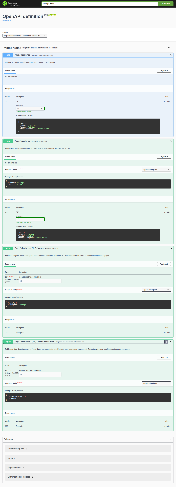
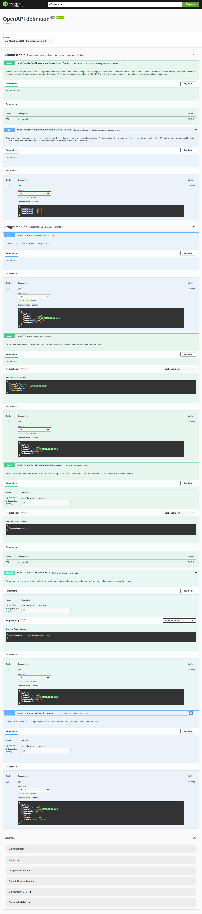
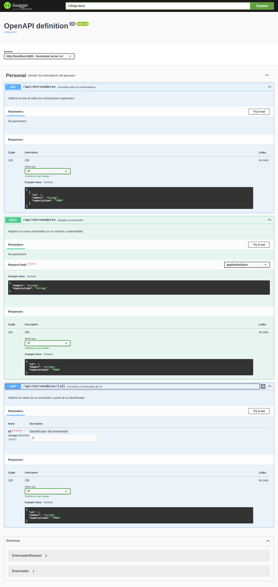
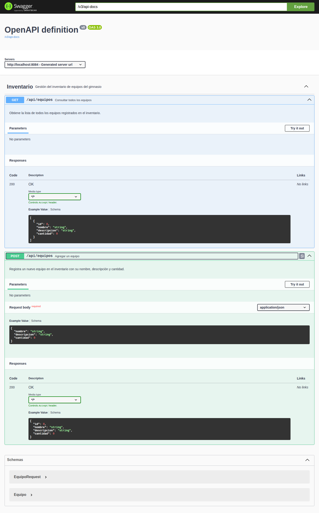

# Evidencias de Swagger / OpenAPI

Cada microservicio incluye `springdoc-openapi-starter-webmvc-ui` 2.5.0 (por ejemplo `ms-membresias/pom.xml:L57-L60`) y expone su documentación sin token: la `SecurityConfig` de cada servicio deja públicas las rutas `/swagger-ui/**`, `/swagger-ui.html` y `/v3/api-docs/**` (`ms-membresias/src/main/java/co/analisys/membresias/config/SecurityConfig.java:L27-L31`, idéntico en los otros tres servicios). Todo lo demás requiere un JWT válido emitido por el realm `gimnasio` de Keycloak.

Las descripciones de cada operación provienen de las anotaciones `@Tag`, `@Operation` y `@Parameter` de los controladores. Los roles requeridos provienen de `@PreAuthorize`.

Las capturas se tomaron el 2026-09-26 con Chromium headless contra el sistema levantado con `docker compose up --build`, con todas las operaciones expandidas.

## Estado de la documentación OpenAPI

| Aspecto | Estado | Evidencia |
|---|---|---|
| Descripción de cada operación (`summary` + `description`) | Implementado | `@Operation` en los 5 controladores |
| Descripción de parámetros de ruta (`id`) | Implementado | `@Parameter(description = ...)` |
| Esquemas de request/response | Generados automáticamente a partir de los records (`MiembroRequest`, `PagoRequest`, etc.) | Sección *Schemas* de cada captura |
| Título y versión de la API | Valores por defecto de springdoc (`OpenAPI definition`, `v0`) | `info` de `/v3/api-docs` |

En cada tabla, la columna "Respuestas documentadas" refleja lo que publica `/v3/api-docs` y la columna "Respuestas reales verificadas" lista los códigos observados en ejecución en esa ruta. Como la autenticación se aplica con `anyRequest().authenticated()` a todas las rutas no públicas, cualquier endpoint devuelve `401` sin token aunque no se haya probado ruta por ruta.

---

## ms-membresias (puerto 8081)

- Swagger UI: <http://localhost:8081/swagger-ui/index.html>
- OpenAPI JSON: <http://localhost:8081/v3/api-docs>
- Tag: `Membresías` — "Registro y consulta de miembros del gimnasio" (`ms-membresias/src/main/java/co/analisys/membresias/controller/MiembroController.java:L18`)

| Método | Ruta | Descripción (`@Operation`) | Roles requeridos (`@PreAuthorize`) | Respuestas documentadas | Respuestas reales verificadas | Código |
|---|---|---|---|---|---|---|
| `POST` | `/api/miembros` | Registrar un miembro (nombre y correo). Publica la notificación de inscripción en RabbitMQ. | `ROLE_ADMIN` | `200` | `200`, `400` (email inválido / nombre vacío), `409` (email duplicado), `403` (TRAINER) | `MiembroController.java:L25-L32` |
| `GET` | `/api/miembros` | Consultar todos los miembros | `ROLE_ADMIN`, `ROLE_TRAINER` | `200` | `200`, `401`, `403` (MEMBER) | `MiembroController.java:L34-L41` |
| `POST` | `/api/miembros/{id}/pagos` | Registrar un pago; se encola en RabbitMQ y un monto inválido cae a la DLQ de pagos | `ROLE_ADMIN`, `ROLE_MEMBER` | `202` | `202`, `401`, `403` (TRAINER) | `MiembroController.java:L43-L53` |
| `POST` | `/api/miembros/{id}/entrenamientos` | Registrar una sesión de entrenamiento; se publica en el topic `datos-entrenamiento` | `ROLE_ADMIN`, `ROLE_MEMBER` | `202` | `202`, `401`, `403` (TRAINER) | `MiembroController.java:L55-L65` |

Parámetros: `id` (path, `integer int64`, "Identificador del miembro") en `/pagos` y `/entrenamientos` (`MiembroController.java:L50`, `L62`).

---

## ms-programacion (puerto 8082)

- Swagger UI: <http://localhost:8082/swagger-ui/index.html>
- OpenAPI JSON: <http://localhost:8082/v3/api-docs>
- Tags: `Programación` — "Programación de clases del gimnasio" (`ms-programacion/src/main/java/co/analisys/programacion/controller/ClaseController.java:L20`) y `Admin Kafka` — "Operaciones administrativas sobre los consumidores de Kafka" (`ms-programacion/src/main/java/co/analisys/programacion/controller/AdminKafkaController.java:L17`)

| Método | Ruta | Descripción (`@Operation`) | Roles requeridos (`@PreAuthorize`) | Respuestas documentadas | Respuestas reales verificadas | Código |
|---|---|---|---|---|---|---|
| `POST` | `/api/clases` | Programar una clase; valida `entrenadorId` contra ms-personal | `ROLE_ADMIN`, `ROLE_TRAINER` | `200` | `200`, `400` (capacidad inválida / entrenador inexistente), `403` (MEMBER) | `ClaseController.java:L27-L34` |
| `GET` | `/api/clases` | Consultar todas las clases | `ROLE_ADMIN`, `ROLE_TRAINER`, `ROLE_MEMBER` | `200` | `200` | `ClaseController.java:L36-L43` |
| `GET` | `/api/clases/{id}/entrenador` | Consultar una clase con su entrenador (consulta a ms-personal reenviando el JWT) | `ROLE_ADMIN`, `ROLE_TRAINER`, `ROLE_MEMBER` | `200` | `200` | `ClaseController.java:L45-L53` |
| `PATCH` | `/api/clases/{id}/horario` | Cambiar el horario; publica el evento pub/sub `clase.horario.cambiado` | `ROLE_ADMIN`, `ROLE_TRAINER` | `200` | `200`, `401`, `403` (MEMBER) | `ClaseController.java:L55-L64` |
| `POST` | `/api/clases/{id}/ocupacion` | Reportar ocupación actual; publica en el topic `ocupacion-clases` | `ROLE_ADMIN`, `ROLE_TRAINER` | `202` | `202`, `401`, `403` (MEMBER) | `ClaseController.java:L66-L76` |
| `POST` | `/api/admin/kafka/ocupacion-clases/reiniciar` | Reiniciar el consumo de `ocupacion-clases` desde el offset 0 (recuperación) | `ROLE_ADMIN` | `202` | `202`, `401`, `403` (TRAINER) | `AdminKafkaController.java:L24-L32` |
| `GET` | `/api/admin/kafka/ocupacion-clases/estado` | Consultar el progreso del consumidor (`mensajesProcesados`) | `ROLE_ADMIN` | `200` | `200` | `AdminKafkaController.java:L34-L41` |

Parámetros: `id` (path, `integer int64`, "Identificador de la clase") en `/entrenador`, `/horario` y `/ocupacion` (`ClaseController.java:L51`, `L61`, `L73`).

---

## ms-personal (puerto 8083)

- Swagger UI: <http://localhost:8083/swagger-ui/index.html>
- OpenAPI JSON: <http://localhost:8083/v3/api-docs>
- Tag: `Personal` — "Gestión de entrenadores del gimnasio" (`ms-personal/src/main/java/co/analisys/personal/controller/EntrenadorController.java:L15`)

| Método | Ruta | Descripción (`@Operation`) | Roles requeridos (`@PreAuthorize`) | Respuestas documentadas | Respuestas reales verificadas | Código |
|---|---|---|---|---|---|---|
| `POST` | `/api/entrenadores` | Agregar un entrenador (nombre y especialidad) | `ROLE_ADMIN` | `200` | `200`, `400` (especialidad fuera de catálogo / nombre vacío), `403` (TRAINER) | `EntrenadorController.java:L22-L29` |
| `GET` | `/api/entrenadores` | Consultar todos los entrenadores | `ROLE_ADMIN`, `ROLE_TRAINER`, `ROLE_MEMBER` | `200` | `200`, `401` | `EntrenadorController.java:L31-L38` |
| `GET` | `/api/entrenadores/{id}` | Consultar un entrenador por id | `ROLE_ADMIN`, `ROLE_TRAINER`, `ROLE_MEMBER` | `200` | `200`, `404` (id inexistente) | `EntrenadorController.java:L40-L48` |

Parámetros: `id` (path, `integer int64`, "Identificador del entrenador") (`EntrenadorController.java:L46`).

---

## ms-inventario (puerto 8084)

- Swagger UI: <http://localhost:8084/swagger-ui/index.html>
- OpenAPI JSON: <http://localhost:8084/v3/api-docs>
- Tag: `Inventario` — "Gestión del inventario de equipos del gimnasio" (`ms-inventario/src/main/java/co/analisys/inventario/controller/EquipoController.java:L14`)

| Método | Ruta | Descripción (`@Operation`) | Roles requeridos (`@PreAuthorize`) | Respuestas documentadas | Respuestas reales verificadas | Código |
|---|---|---|---|---|---|---|
| `POST` | `/api/equipos` | Agregar un equipo (nombre, descripción, cantidad) | `ROLE_ADMIN` | `200` | `200`, `400` (cantidad negativa), `403` (MEMBER) | `EquipoController.java:L21-L28` |
| `GET` | `/api/equipos` | Consultar todos los equipos | `ROLE_ADMIN`, `ROLE_TRAINER`, `ROLE_MEMBER` | `200` | `200` | `EquipoController.java:L30-L37` |

---

## Cómo se verificaron las respuestas reales

- `401` / `403` / `200`: peticiones `curl` con tokens de `admin1`, `trainer1` y `member1`, sin token, con token malformado, con firma alterada y con un token vencido (emitido 375 s antes, `accessTokenLifespan = 300` en `keycloak/full-export/gimnasio-realm.json:L8`). El `401` incluye `WWW-Authenticate: Bearer error="invalid_token"` y el `403` incluye `WWW-Authenticate: Bearer error="insufficient_scope"`.
- `400` / `404` / `409`: colección `postman/Gimnasio-Microservicios.postman_collection.json` ejecutada con newman el 2026-09-26: 64 peticiones, 85 aserciones, 0 fallos.

## Capturas

| Archivo | Estado | Contenido |
|---|---|---|
| `swagger/img/ms-membresias.png` | Tomada | 4 operaciones expandidas, schemas `MiembroRequest`, `Miembro`, `PagoRequest`, `EntrenamientoRequest` |
| `swagger/img/ms-programacion.png` | Tomada | 7 operaciones expandidas (tags `Programación` y `Admin Kafka`) |
| `swagger/img/ms-personal.png` | Tomada | 3 operaciones expandidas |
| `swagger/img/ms-inventario.png` | Tomada | 2 operaciones expandidas, schemas `EquipoRequest`, `Equipo` |

Para regenerarlas: levantar el sistema (`docker compose up --build`) y abrir cada URL de Swagger UI; no requieren token.
